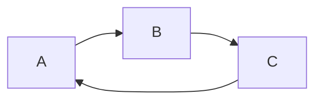
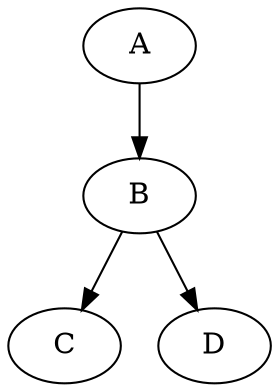

# ~

```sequence
participant A
participant B
participant C

A->B: func
```


```mermaid
  graph LR
    A --> B;
    B --> C;
    C --> A;
```


```dot
digraph G {
    A -> B
    B -> C
    B -> D
}
```
