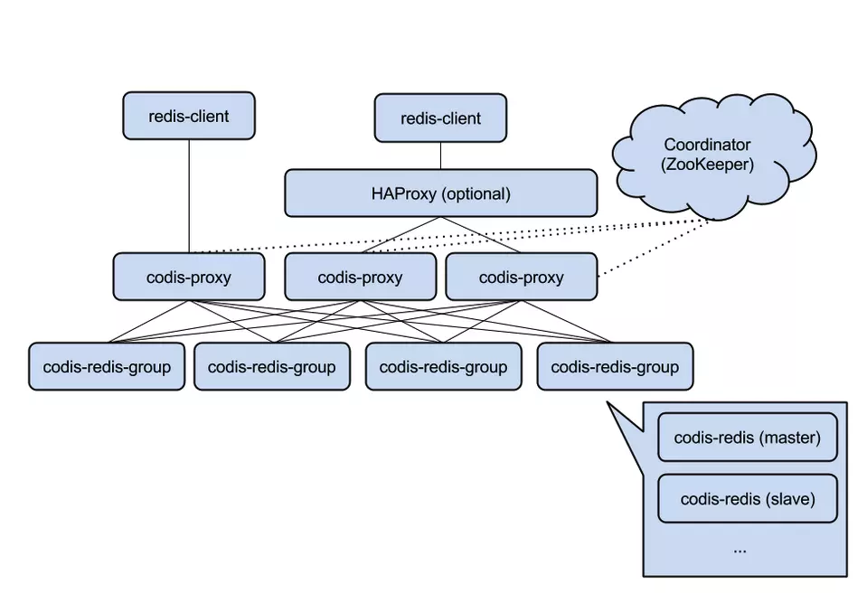

# master feature

## 概况

## backend

crontab方案  

- machine \* cpunum * section

优化

1. 每个PHP进程去redis中自增一个key，获得自己的处理id
2. 选择一个优化比例，暂定 25
3. id 对 25 取余
4. 区服id对 25 取余
5. 如果两个取余结果不同，跳过该区服
6. 如果两个取余结果相同，按照现有的逻辑处理。

dynamicTask  
自动匹配战斗  

- process_control_timeout (phpfpm.conf) --- quit信号的超时时间，超过该时间会在 `process_control_timeout+1` 后terminat。设置不合理，则reload会导致terminat。建议值同 `request_terminate_timeout`
- max_execution_time (php.ini) --- Fatal Error; 不包含system()，sleep()等系统调用，数据库处理时间，比较鸡肋
- request_terminate_timeout (phpfpm.conf) --- 502Bad Gateway; 包含请求的一切时间; 会与 `max_execution_time` 同时生效，谁先到达谁起作用。
  - nginx超时 ?
  - php fork, php-fpm fork ?
  - nginx, php-fpm proc ?

问题

1. 缺少秒级定时器服务

## battle

战斗服方案流程 复盘与计算战力

1. 不支持扫荡 --- 生成多个种子，抽其中一场校验 or 生成多个种子，全部进行校验
2. 战斗服bug数值溢出, 影响伤害排行类活动 --- backend校验
3. get打弱者, fight打强者, 战斗服进行打弱者的校验。 --- 以fight的强者 覆盖 get的弱者(只适合npc) 或 校验对手标记id
4. get一次, fight多次, 战斗服以get的数据进行校验, get那次胜利则后面的多次fight都胜利。 --- 传递战斗数据给战斗服后，从redis中删除get的数据

限制

1. luajit内存限制 --- pool = jit * n < 1G
2. luapool多版本回收问题 --- 新版本
3. fight_server_error --- jit

问题

1. 缺少过期销毁机制。

## redis

  

twemproxy  

1. 分片aof导致损坏 -> rdb还原 --- 数据一致性  
2. 集群变单例，master做aof，rewrite失败 -> 改slave做aof --- 备份都在slave做  

1. 无法平滑扩容缩容
    1.1 Codis: zookeeper + 一致性哈希

## mongodb

  

replica  

1. 写入慢 wm -> w1  
2. 增量回档失败 -> 全量回档 --- 全量备份周期优化, 用mongo还原redis排行榜  
3. 单连数据库master问题  

问题

1. 无法自动换主。
2. 难以应对单服用户量激增。

## exp

预设脚本 - 发道具，修改删除数据，重置玩法  
配置检查 - excel, mtool, code  
监控报警 - 对redis持久化数据监控(尤其有赛程的玩法)并钉钉报警  
灾难预案 - 断电，物理机损坏，备份还原失败，突发bug协作。。。  
单元测试 - 开发效率与单元测试取舍  
代码互审 - merge request  
错误监控 - 日常监控错误  

## method

交叉
复习

## github

`https://github.com/sung1011/note`
