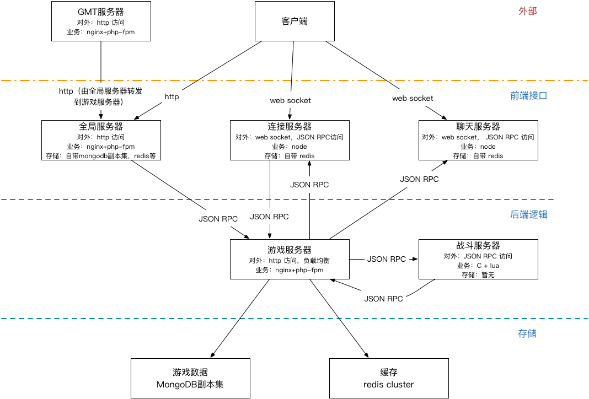
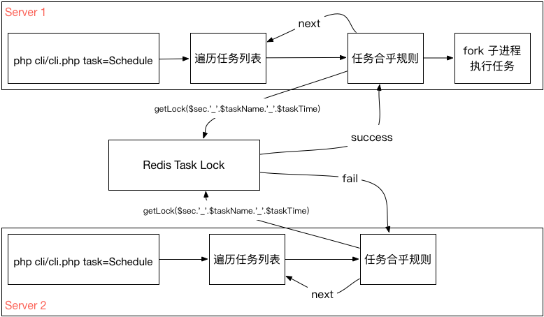
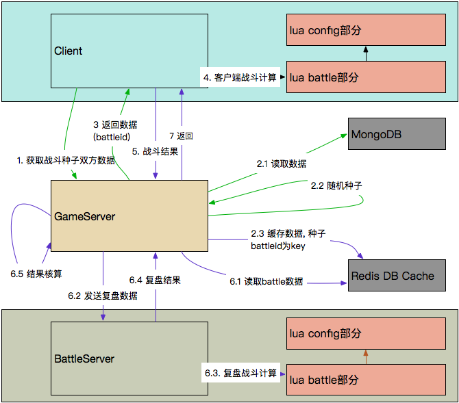
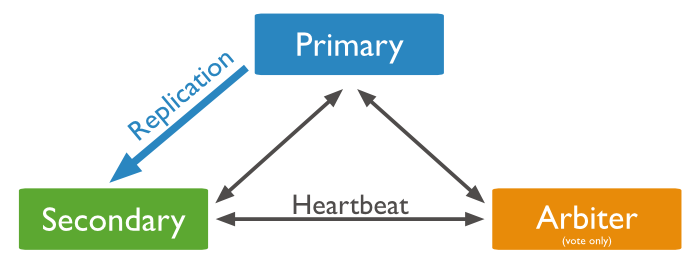

# master feature

## 概况

架构说明，模块缺陷，源码解析，经验分享

---

## fw



### 问题

1. chat服务 --- kakura的尴尬 全服聊天
2. match服务
3. vms统一并且高效 --- 横向支撑

---

## backend



crontab方案  

machine \* cpunum * section 如: `50 * 8 * 100 = 40000`

### 优化

#### cpunum优化

固定2 如: `50 * 2 * 100 = 10000`

#### 加锁区服数量优化

1. 每个PHP进程去redis中自增一个key，获得自己的处理id
2. 选择一个优化比例，暂定 25
3. id 对 25 取余 `a = id % 25`
4. 区服id对 25 取余 `b = sec % 25`
5. 如果两个取余结果不同，跳过该区服 `if a != b; continue;`
6. 如果两个取余结果相同，按照现有的逻辑处理。 `if a == b; run()`

`50 * 2 * 100 = 10000` -> `50 * 2 * (100/25) = 400`

#### 可靠性

`13 * 2 > 25` 即：机器数 * 2 > 优化系数; id必须大于25，若小于25，一些sec会不执行。  
`50 * 2 * (1 - x) >= 25; x = 0.75` 即75%挂了(13/50正常 37/50挂了)扔可用。

### 应用

progress  --- `kv k=taskId v=timestamp`  
dynamicTask --- `zset score=time member=val`  
匹配战斗  

- 独立的match服务
- kakura
- fork
- sleep 抢到锁后，向本地nginx请求，重新分配worker进行间隔性sleep处理，阻塞该worker。

```markdown
# 方案a
php-fpm pool www pm=static; listen=9000; pm.max_children = 200
200个worker中的其中一部分sleep()阻塞方式处理match任务。

优点
accept的worker不会处理其他任务，200个worker足以满足

缺点
随着`os内存、单worker内存上限、crontab调度方式`的调整，最差可能出现worker全部阻塞的情况。

# 方案b
php-fpm开两个pool www和match
- www(默认)   处理游戏逻辑 `pm=static; listen=9000; pm.max_children = <200`
- match 专门处理匹配 `pm=dynamic / ondemand; listen=9001; pm.max_children = 200-www的pm.max_children`

优点
保障了游戏逻辑不受影响阻塞的影响

缺点
占用了部分www的资源
```

### backend问题

1. 超时 ?
   - max_execution_time (php.ini) --- `Fatal Error`; 不包含system()，sleep()等系统调用，数据库处理时间，比较鸡肋
   - request_terminate_timeout (phpfpm.conf) --- `502 Bad Gateway`; 包含请求的一切时间; 会与 `max_execution_time` 同时生效，谁先到达谁起作用。
   - fastcgi_read_timeout(nginx.conf) --- `504 Gateway timeout`; FastCGI服务器的响应超时时间。
   - process_control_timeout (phpfpm.conf) --- quit信号的超时时间，超过该时间会在 `process_control_timeout+1` 后terminat。设置不合理，则reload会导致terminat。建议值同 `request_terminate_timeout`
   - 其他
     - fastcgi_connect_timeout(nginx.conf) --- 连接到后端fastcgi超时时间
     - fastcgi_send_timeout(nginx.conf) --- 向fastcgi请求超时时间
2. php-fpm worker 尽量多 ?
3. php fork, php-fpm fork ?

---

## battle



战斗服方案流程 复盘与计算战力

1. 不支持扫荡 --- 生成多个种子，抽其中一场校验 or 生成多个种子，全部进行校验
2. 战斗服bug数值溢出, 影响伤害排行类活动 --- backend校验
3. get打弱者, fight打强者, 战斗服进行打弱者的校验。 --- 校验对手标记
4. get一次, fight多次, 战斗服以get的数据进行校验, get那次胜利则后面的多次fight都胜利。 --- 传递战斗数据给战斗服后，从redis中删除get的数据

### battle问题

1. luajit内存限制 --- `luaMaxMem * poolSize * script < 1024M` --- `51.2M * 8 * n < 1024M`。
2. 多版本回收问题 --- 新版本 `maxCallCount`, `luaMaxMem` 缺少过期销毁机制。
3. fight_server_error --- luajit超时 `maxWaitMillis`。

---

## redis

  

twemproxy  

1. 分片的aof损坏 -> rdb还原 --- mongodb还原redis排行榜保障数据一致性  
2. 集群变单例，master做aof，rewrite失败 -> 改slave做aof --- 备份都在slave做  

### redis问题

1. 无法平滑扩容缩容
2. 缺少管理 --- 过期条件, 大key监控

---

## mongodb

  

### mongodb问题

1. 写入慢 --- Write Preference wm -> w1
2. 增量回档失败 -> 全量回档 --- 全量备份周期优化
3. 无法自动换主 单连数据库master问题 ? --- client get
4. 缺少管理 --- 过期条件，大doc监控
5. 难以应对单服用户量激增。 --- sharding, Read Preference  

---

## exp

预设脚本 - 发道具，修改删除数据，重置玩法  
配置检查 - excel, mtool, code  
监控报警 - 对redis持久化数据监控(尤其有赛程的玩法)并钉钉报警  
灾难预案 - 断电，物理机损坏，备份还原失败，突发bug协作。。。  
单元测试 - 开发效率与单元测试取舍  
代码互审 - merge request  
错误监控 - 日常监控错误  
版本发布 - 冲掉hotfix, 审核服重复用serviceId, 上架未删ver令online玩家进audit等  

---

## method

交叉  
复习
