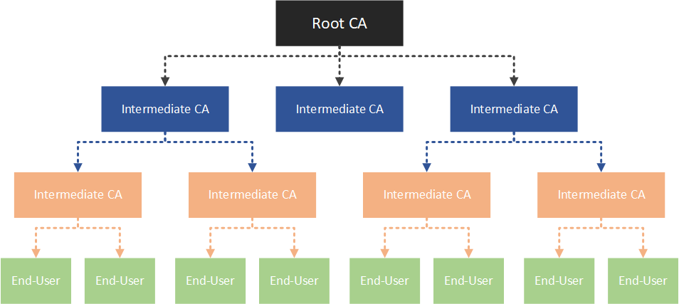
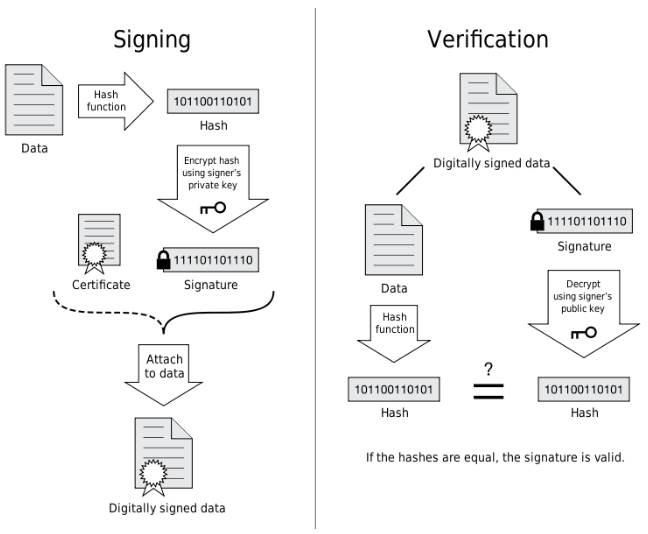

# CA 证书

## 意义
验证HTTPS网站是否可信  
防止中间人攻击  

## 证书链
证书以证书链形式存在。  
最上层为root，即CA，用来颁发证书。  
最下层为end-user，对应每个网站购买使用的证书。  
中间层为intermediates，即二级CA、三级CA...帮助root颁发证书。  

## 证书组成

公钥  :公开  
私钥  :由证书所有者(你的服务端)保管  
签名  :利用**上一层证书的私钥** (即,每个上层证书会对下一层的证书合法性做担保)，加密一些元信息（证书所有者的信息，包括**基本信息**，**服务端(证书持有者)公钥**，证书生效域名等）。  
其他  :颁发机构，有效期...  


## 签发流程
0. 服务端拥有签发人私钥(证书私钥)。
1. 撰写证书数字证书(元数据)： 
   1. 包括 签发人( Issuer )( 证书链上层 )、地址、签发时间、有效期 等
   2. 还包括证书持有者( Owner )的基本信息，比如 DN(DNS Name，即证书生效的域名)、 **Owner的公钥** 等
2. 使用通用的 Hash 算法（如SHA-256）对证书元数据计算生成 **数字摘要**
3. 使用 Issuer 的私钥对该数字摘要进行加密，生成一个加密的数字摘要，即 Issuer 的 **数字签名**
4. 将数字签名附加到数字证书上，变成一个 **签过名的数字证书**
5. 将签过名的数字证书与 **Issuer 的公钥** 一同发给证书客户端。

```
证书 = 多个元数据 = 签发人( Issuer )、签发时间、有效期 + 证书持有者( Owner )的基本信息，比如 DN(DNS Name，即证书生效的域名)、 Owner的公钥...  

摘要 = hash(证书) = hash算法如SHA-256对数字证书加密  

签名 = Issuer.rsa-private(摘要) = Issuer的私钥加密数字摘要  

签名证书 = 证书 + 签名  

签发 = send-to-客户端 签名证书 + 签发人的公钥  
    = send-to-客户端 证书 + 签名 + 签发人的公钥  
    = send-to-客户端 证书 + Issuer.rsa-private(摘要) + 签发人的公钥  
    = send-to-客户端 证书 + Issuer.rsa-private(hash(证书)) + 签发人的公钥  
```

> Owner的公钥会在之后的非对称加密过程中用到。

## 验证流程
0. 客户端获得签发人公钥(证书链上层公钥)。
1. 客户端获通过某种途径（如浏览器访问）获取到签名证书，解压出 **证书元数据** 和 **数字签名**
2. 使用同样的Hash算法计算证书元数据的 **数字摘要**
3. 使用 **Issuer的公钥** 对数字签名进行解密，得到 解密后的数字摘要
4. 对比 2 和 3 两个步骤得到的数字摘要值，如果相同，则说明这个数字证书确实是被 **Issuer** 验证过合法证书，证书中的信息（最主要的是**Owner的公钥**）是可信的

```
验证 = 客户端-get 签名证书 + 签发人的公钥
    = 客户端-get 签名 + 证书 + 签发人的公钥 

    -> Issuer.rsa-public(签名) == 摘要 == hash(证书)
```

> 签发人的公钥 应去第三方机构证书链上层寻找
> 若服务端使用自签名的证书(自己颁发的根证书，非法、非权威、非第三方)，需要下载安装根证书到用户机器的内置证书中，除非特别信任该机构，否则不要导入很危险。(比如：该非法根证书验证危险网站)

## 类型
### DV domain validated 域名验证  
便宜 快捷  
### OV organization validated 组织验证  
较贵 中速
### EV extended validated 扩展验证  
最贵 难申请 浏览器显示名称与国家  

## 申请流程
1. 生成客户端(即你的服务端)的密钥，即客户端的公私钥对，且要保证私钥只有客户端自己拥有。
2. 以客户端的密钥和客户端自身的信息(国家、机构、域名、邮箱等)为输入，生成证书请求文件。其中客户端的公钥和客户端信息是明文保存在证书请求文件中的，而客户端私钥的作用是对客户端公钥及客户端信息做签名，自身是不包含在证书请求中的。然后把证书请求文件发送给CA机构。
3. CA机构接收到客户端的证书请求文件后，首先校验其签名，然后审核客户端的信息，最后CA机构使用自己的私钥为证书请求文件签名，生成证书文件，下发给客户端。此证书就是客户端的身份证，来表明用户的身份。

## ref
[ 证书链 ](https://www.jianshu.com/p/fcd0572c4765)