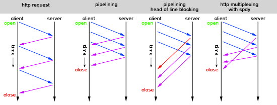

# HTTP/1.1

    @@HTTP

    允许持久连接, 默认keep-alive, 减少握手开销. 但引发对头阻塞(Head-of-line blocking)
    新增chunked 允许响应数据分块传输 产生一块数据就返回一块数据
    新增方法: PUT、DELETE、PATCH、OPTIONS等
    新增头host 同物理机不同服务
    新增返回头Content-Length, 以帮助返回多个响应包时客户端拆分包数据.
    新增缓存管理和控制

## 持久连接 persistent connection

```bash
    # TCP三次握手
    c -> s  # syn
    c <- s  # ack + syn
    c -> s  # ack

    # 普通的请求 & 响应
    ...
    c -> s
    c <- s

    c -> s
    waiting...      # 对头阻塞
    waiting...
    waiting...
    c <- s

    c -> s
    c <- s

    c -> s
    c <- s
    ...

    # TCP四次挥手
    c -> s  # fin
    c <- s  # ack
    c <- s  # fin
    c -> s  # ack
```

- 优点

      相比 [短连接](HTTP-0.9.md#短连接) 省去了每次请求握手, 挥手的时间.

- 缺陷

      `队头阻塞` 一去一回的严格的顺序应答, 第一个请求慢了, 后面的请求都被阻塞.

## HTTP管道化

    一次性发起多个req, 并`按顺序(FIFO)`接收处理返回.
    不推荐使用

  

- 优点

      `并发` 在同一连接中, 多个请求并发.优化了传输效率.

- 缺陷

      `队头阻塞` 同上
      `顺序性` 顺序错了, 客户端就会处理错误
      `幂等性` 过程中如果连接中断, 整个pipelining都要重发, 其中非幂等方法也会被重复提交.

> 幂等 upd val=10 多次请求结果一致, 都是10

> 非幂等 upd val+=1 多次请求结果不一致, 越加越多

> 也可以由S端写逻辑来保证pipeline的内容全部commit, 或有一个错误就都不commit

## 增多连接数

- 优点

      多开连接数, 避免对头阻塞; `域名分片` 浏览器为每个host开6~8个连接, 将域名分片成多个, 以提高连接数

- 缺点

      对S端不友好, 连接数有限
      不一定提升效率, C端消耗更多内存, 合并处理数据

## ref

- [TCP三次握手](TCP.md)