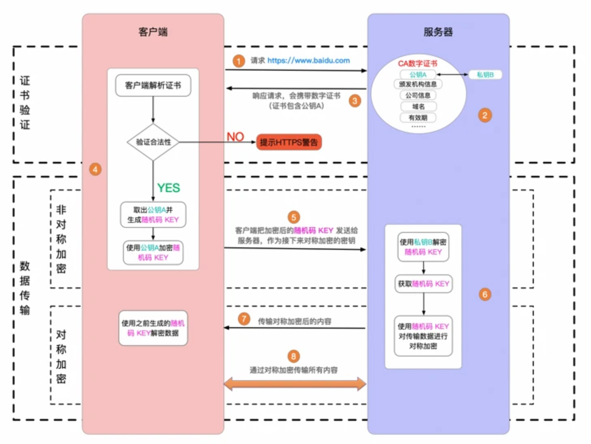

# SSL / TLS

## SSL (Secure Sockets Layer) / TLS (Transport Layer Security)

### 概念

[RSA](RSA.md) 秘钥交换, 身份验证(非对称加密)  
[AES-128-GCM](AES.md) 密码 对称算法-强度128-分组模式(对称加密)  
[SHA256](SHA.md) MAC或PRF签名HASH算法(散列)  

> Cipher Suite : TLS ECDHE RSA WITH AES 128 GCM SHA256

## [Certificate(CA 证书)](CA.md)

## 组成

记录层  
握手层  

- 握手协议 (handshake protocol)
- 更改加密规范协议 (change cipher spec protocol)
- 应用数据协议 (application data protocol)
- 和警告协议 (alert protocol)  

## 记录层

### 分片 (Fragmentation)

### 记录压缩和解压缩 (Record compression and decompression)

### 空或标准流加密 (Null or standard stream cipher)

### CBC 块加密 ([分组加密](cryptMode.md))

### 记录有效载荷保护 (Record payload protection)

### 密钥计算 (Key calculation)

## 握手层

1. ClientHello – 客户端发送所支持的 SSL/TLS 最高协议版本号和所支持的加密算法集合及压缩方法集合等信息给服务器端。
2. ServerHello – 服务器端收到客户端信息后，选定双方都能够支持的 SSL/TLS 协议版本和加密方法及压缩方法，返回给客户端。
3. SendCertificate – 服务器端`发送服务端证书给客户端(其中包含公钥rsa.pub)。`
4. （可选）RequestCertificate – 如果选择双向验证，服务器端向客户端请求客户端证书。
5. ServerHelloDone – 服务器端通知客户端初始协商结束。
6. （可选）ResponseCertificate – 如果选择双向验证，客户端向服务器端发送客户端证书。
7. ClientKeyExchange – `客户端使用服务器端的公钥，对客户端公钥和密钥种子(为了对称加密)进行加密，再发送给服务器端。`
8. （可选）CertificateVerify – 如果选择双向验证，`客户端用本地私钥生成数字签名，并发送给服务器端，让其通过收到的客户端公钥进行身份验证。`
9. CreateSecretKey – `通讯双方基于密钥种子等信息生成通讯密钥(对称加密的key)。`
10. ChangeCipherSpec – 客户端通知服务器端已将通讯方式切换到加密模式。
11. Finished – 客户端做好加密通讯的准备。
12. ChangeCipherSpec – 服务器端通知客户端已将通讯方式切换到加密模式。
13. Finished – 服务器做好加密通讯的准备。
14. Encrypted/DecryptedData – `双方使用客户端密钥，通过对称加密算法对通讯内容进行加密。`
15. ClosedConnection – 通讯结束后，任何一方发出断开 SSL 连接的消息。

## 实战

openssl是TLS、SSL协议的开源实现

## ref

[TLS详解](https://www.codercto.com/a/24035.html)
