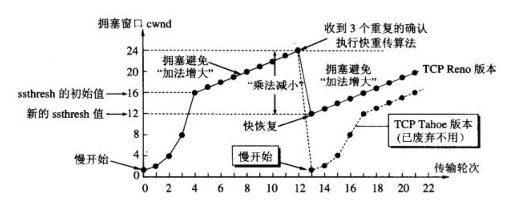

# TCP

## 标志位  

- **SYN** synchronous 建立联机
- **ACK** acknowledgement(确认) 向对方发送确认
- **PSH** push(传送) 接收端尽快传送数据到应用层, 不必等缓冲区满再发送.
- **FIN** finish(结束) 结束连接
- **RST** reset(重置) 告知对方可以重置状态(清空端口值数据)
- **URG** urgent(紧急)

- **seq** Sequence number(顺序号码)
- **ack** Acknowledge number(确认号码)

## 通讯流程

### 三次握手

```bash
    C -------------------------> S: `SYN` seq=j # 在吗, 我要联机
  SYN_SEND                    SYN_RCVD


    C <------------------------- S: `ACK` ack=j+1, `SYN` seq=k # ok, 在
  ESTABLISHED


    C -------------------------> S: `ACK` ack=k+1 # ok, 建立连接吧
                            ESTABLISHED

# 第三次握手的意义: C端认为超时
    # 若无第三次握手: S端会在第二次握手就开始建立连接, 而C端此刻已经认为过期并重新建一条连接了, 浪费S资源.
    # 有第三次握手: 当第一次 第二次握手出现延迟, S端依然会正常响应, 但C端已认为过期, 于是不会发起第三次握手建立连接, 重新建立连接.
```

> [syn_ack flood](ddos-syn-ackflood.md)

### 四次挥手

```bash
    C --------------------> S: `FIN` seq=i # C: 可以关吗
 FIN_WAIT1              CLOSE_WAIT (并发请求太多, 处理不过来)


    C <-------------------- S: `ACK` ack=i+1 # S: ok收到, 稍等, 请C别发了, 我处理完手上的就关
 FIN_WAIT2 (半关闭连接.C端进入只收不发状态)
                        CLOSE_WAIT


    C <-------------------- S: `FIN` seq=j # S: (处理完了)可以关了, 请C进入time_wait
 TIME_WAIT              LAST_ACK (压测时C端突然断开, S端很多LAST_ACK


    C --------------------> S: `ACK` ack=j+1 # C: ok, 你先关吧, 我等2MSL就关. (并且轮询几下)
                        先CLOSED
2MSL后CLOSED

# 第二, 三次挥手的意义 close_wait
    # 服务端还在处理数据无法立即关闭socket, 故只能先回复一个ACK确认.  

# 第四次挥手的意义 time_wait
    # C真正关闭需要`2MSL`(长)时间 因为第四次挥手时 C已经给S发了ack使其关闭, 如果时间短C关闭并又复用成C', 这时一些延迟的数据包本应给C 却错误的给到C'
    # 第四次挥手时重复几次ack这个过程, 以确保S连接关闭
```

> `MSL` maximum segment lifetime 报文最大生存时间 30s~60s

## 可靠传输

```bash
    发出报文在超时时间内没有收到确认, 则重传
```

## 流量控制

```bash
# 无流量控制

# S端接收C端的数据后进行缓存, 并持续消费缓存数据
# 缓存区已满时, 数据会被丢弃
               2k
    C --------------------> S   2k/4k
    C <-------------------- S
               ack

               2k
    C --------------------> S   4k/4k
    C <-------------------- S
               ack

               2k
    C --------------------> S   4k/4k 缓存区已满, 丢弃
```

```bash
# 流量控制

# 控制C的发送流量, 从而使S来的及接受和处理数据
# S端每次收到数据包后, 返回缓存区剩余多少空间(接收窗口rwnd)
# C端将其设置为发送流量的上限(发送窗口cwnd)
# 由于S端同时也在持续的消费缓存区的数据, 所以cwnd<当前缓存区剩余空间

# cwnd=0时, 设置定时器, 定时探测rwnd的变化
               2k
    C --------------------> S   2k/4k
    C <-------------------- S
           ack,rwnd=2k
cwnd=2k

               2k
    C --------------------> S   3k/4k   3k=2-1+2 S消费了1k
    C <-------------------- S
           ack,rwnd=1k
cwnd=1k

               1k
    C --------------------> S   4k/4k   4k=3-1+2 S消费了1k
    C <-------------------- S
           ack,rwnd=0k
cwnd=0停止发送, 设置定时器

            试探包文
    C --------------------> S   3k/4k   2k=4-1 S消费了1k
    C <-------------------- S
           ack,rwnd=1k
cwnd>0, 继续发送
```

## 超时 与 重传

```bash
    不是固定时间, 而是动态的, 每个连接有独立的超时时间
    超时后会重传
```

> `RTT Round-Trip-Time` 往返时延，也就是数据包从发出去到收到对应 ACK 的时间。RTT 是针对连接的，每一个连接都有各自独立的 RTT。

> `RTO Retransmission-Time-Out` 重传超时，也就是前面说的超时时间。

## 拥塞控制 与 重传



    控制C的并发量, 避免网络负载过大

- 慢开始 与 拥塞避免 (废弃)

```bash
# 慢开始

# 由小逐渐翻倍变大cwnd
cwnd=1k
    C --------------------> S
    C <-------------------- S

cwnd=2k
    C --------------------> S
    C <-------------------- S

cwnd=4k
    C --------------------> S
    C <-------------------- S

# 拥塞避免

# 当cwnd>=一个熵值(ssthresh)时 从慢开始算法转为拥塞避免算法
# cwnd从翻倍 变为 cwnd+=1k (加法增大)
# 假设ssthresh=16k
cwnd=16k
    C --------------------> S
    C <-------------------- S


cwnd=17k
    C --------------------> S
    C <-------------------- S

cwnd=18k
    C --------------------> S
    C <-------------------- S

# 网络拥塞

# 减半ssthresh (乘法减小), 并缓慢ssthresh+1 (加法增大), cwnd重置为1
cwnd=18k
    C --------------------> S  出现拥塞 (没有按时收到ack)
    C <-------------------- S
           慢ack,rwnd=0
cwnd=1k, ssthresh=9k (出现网络拥塞时的窗口大小的一半 (cwnd/2 = 18/2))

cwnd=1k
    C --------------------> S
    C <-------------------- S
           慢ack,rwnd=x
cwnd=2k, ssthresh=10k = 9k+1k

```

- 快重传 与 快恢复

```bash
# 快重传 快恢复

# 不设置定时器, 3次ack后马上重传丢失的数据包#2
# 重传后不进行慢开始(cwnd=1) 而是设置为与ssthresh相等(cwnd=ssthresh)
                #1
    C --------------------> S
    C <-------------------- S

                #2
    C ----------X           S

                #3
    C --------------------> S
    C <-------------------- S
                #2呢?

                #4
    C --------------------> S
    C <-------------------- S
                #2呢?

                #5
    C --------------------> S
    C <-------------------- S
                #2呢?

                #2   询问3次后 快速重传#2
    C --------------------> S
    C <-------------------- S

# cwnd=9k(与sthresh相等), ssthresh=9k (出现网络拥塞时的窗口大小的一半 (cwnd/2 = 18/2))
```

> "快重传+快恢复"相比"慢开始+拥塞避免", 重传更快(不用等计时器), 窗口恢复更合理(cwnd不用重置为1, 而是重置为ssthresh相同的值)

## 粘包 拆包

- 粘包 C同时发送多个数据包, tcp将其打包成一个TCP包文发送; 通过TCP发送缓冲区
- 拆包 C发送的TCP数据包超过传输最大值, 会被拆包

```bash
# 假如发送缓冲区/接收缓冲区容量都是5
                    send buffer (cap=5)                           recv buffer (cap=5)
        C -----------> < aabbb > -------------TCP连接-------------> < iijkk > -----------------> S
            aa         (粘包)      bcccc ccccc ccdde efghi                       kk lll m nnn... (拆包)
```

> HTTP协议会帮助处理粘包/拆包, 基于TCP自定义协议需要关注粘包/拆包问题.

> `重传` 丢包使数据不完整, 则会整个重传

## ref

- 超时与重传机制 <https://zhuanlan.zhihu.com/p/101702312>
- tcp状态 <https://blog.csdn.net/wuji0447/article/details/78356875>
- 理解TCP <https://www.jianshu.com/p/ca64764e4a26>
- TCP流量控制,拥塞控制 <https://zhuanlan.zhihu.com/p/37379780>
- 流量控制 <https://www.cnblogs.com/kubidemanong/p/9987810.html>
- 传输层 <https://github.com/CyC2018/CS-Notes/blob/master/notes/%E8%AE%A1%E7%AE%97%E6%9C%BA%E7%BD%91%E7%BB%9C%20-%20%E4%BC%A0%E8%BE%93%E5%B1%82.md>