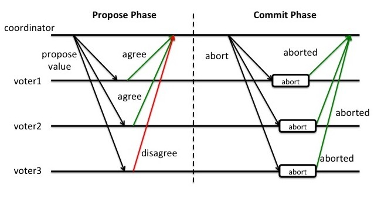

# 事务 (transactions)  

    对某一数据库的操作要么全部执行,要么全部不执行,是一个不可分割的工作单位.

> 可以想象成 余额`B`是订单`O`的冗余数据, 同时修改余额和订单, 需要事务

> 事务以库划分, 库内操作时事务, 跨库操作是分布式事务

## ACID 四大特性  

### `A 原子性`

```md
    即`不可分割`性, 事务要么全部被执行, 要么就全部不被执行
```

### `C 一致性`

```md
    数据库从一种正确状态转换成另一种`正确状态`
```

### `I 隔离性`

```md
    在事务`正确提交之前`, 不允许把该事务对数据的任何改变提供给任何其他事务
```

### `D 持久性`

```md
    事务正确提交后, 其结果将`永久保存`在数据库中, 即使在事务提交后有了其他故障, 事务的处理结果也会得到保存
```

> `ACI强调` 的角度不同, 但概念有点杂糅

> `A原子性` a100 b100, a-20 b+20, 这两个动作要么全部执行, 要么全部不执行.

> `C一致性` a100 b100, a-20 b+20, AB的总额一直是200, 不会变化.

## 一致性级别

- 强一致性 更新某个副本后, 之后所有读操作都读到最新数据

- 弱一致性 更新某个副本后, 用户需要等待一段延迟时间才能读到最新数据, 延迟期间不可以读取数据
  - 最终一致性 更新某个副本后, 用户需要等待一段延迟时间才能读到最新数据, 延迟期间可以读取不一致数据 (一种特殊的弱一致性)

## 隔离级别  

| 隔离级别    | 脏读 DR| 不可重复读 NR | 幻读 PR |
| ----------- | ---- | ---------- | ---- |
| 读未提交 RU | o    | o          | o    |
| 读已提交 RC | x    | o          | o    |
| 可重复读 RR | x    | x          | o    |
| 串行 S      | x    | x          | x    |

### 影响

- `脏读 DR dirty-read` 事务a正在更新x未提交, 事务b读取了x, 某些原因事务a rollback了, 事务b读到的x就是错误的.

- `不可重复读 NR non-repeatable read` 一个事务a内的两次查询结果值不一致, 可能查询期间事务b的修改导致.

- `幻读 PR phantom-read` (不常见) 一个事务a内的两次查询结果字段不一致, 可能查询期间事务b的修改导致.

### 隔离级别

- `读未提交 RU read-uncommitted` (不常见) 见"脏读"

- `读已提交/不可重复读 RC read-committed` 见"不可重复读"; 非幂等读取

- `可重复读 RR repeatable-read` 幂等读取; 如同读取一份快照, 改完覆盖写入

- `串行化 serializable` (不常见) 无并发, 性能差, 同步锁, 无需隔离

### 实例

#### RC读已提交 vs RR可重复读

```sql
# (session)A看到初始状态为一笔订单(id:3) 和 100余额, 并且A`未commit事务`
$A begin;
$A select * from orders; # [ id:3, amount:100 ]
$A select * from balance; # blance: 100

    # (session)B在A`未commit事务`的情况下, commit了一个事务, 插入一笔订单(id:4),同时增加50余额
    $B begin;
    $B insert into orders values(4, 50);
    $B update balance set balance = balance + 50;
    $B commit;

# RC 读已提交:
  # 在A`未commit事务`的情况重复读取数据, order和balance`会读到B的提交`, 即被其他事务干扰
$A select * from orders; # [ id:3, amount:100 ], [ id:4, amount:50 ]
$A select * from balance; # blance: 150
$A ...
$A commit;

# RR 可重复读
  # A`未commit事务`的情况重复读取数据, order和balance`不会读到B的提交`, 即体现了事务的隔离性
$A select * from orders; # [ id:3, amount:100 ]
$A select * from balance; # blance: 100
$A ...
$A commit;
```

## CAP  

### P 分区容错 Partition tolerance

      指网络故障时两个分区节点是否相同
      一般认为P总是成立, 剩下的C, A无法同时做到.  

### C 一致性 Consistency

      两个实例保证相同状态.

### A 可用性 Availability

      两个实例挂掉一个另一个还能提供服务.

### CP型

      牺牲可用性, 保证强一致性.

### AP型

      牺牲一致性, 保证高可用性.

## 分布式事务

### 本地消息表

      转化为本地事务, 效率高, 但只保障最终一致性

#### 流程

1. 在一个事务中更新余额`B`并记录一条需要新增订单`O`的Log并commit
2. 用一个异步的服务读取**新增订单`O`的Log**, 并执行该新增操作
3. 若执行成功则删除Log; 若执行失败, 则重试.

> 以余额`B` 和 订单`O` 为例

> Log记录成本地文件 或 其他形式也可以

### 2PC 二阶段提交

      比较常用的分布式事务方案, 适合需要强一致性, 并发量小的场景

#### 成员

- 1个协调者节点 `C` coordinator
- N个参与者节点 `P` partcipant

#### 阶段




##### 阶段1: 提出 propose

  1. `C` -> `P` 请求事务询问
  2. `P` 本地执行事务但不commit
  3. `P` -> `C` 响应询问结果

##### 阶段2: 提交/执行 commit

- 当响应询问结果全部ok
  1. `C` -> `P` 请求事务commit
  2. `P` 事务commit

- 当响应询问结果任一异常 or 等待超时
  1. `C` -> `P` 发送rollback请求
  2. `P` 本地执行事务rollback

#### 缺点

##### 性能

     过程中资源被锁住

##### 单点`C`

- `C`正常, `P`挂了

```js
  现象: C阻塞等待P响应  
  解决: 超时机制
```

- `C`挂了, `P`正常

```js
  现象: 由于C是单点, 所以无论处于哪个阶段, C挂后未提交的操作都会阻塞
  解决: C改为主备两个节点, 并记录oplog. C主挂后由C备取代, 并读取oplog
```

- `C`, `P`都挂了

### 3PC

### TCC

### Saga

## ref

[2PC和3PC原理](https://www.cnblogs.com/qdhxhz/p/11167025.html)
