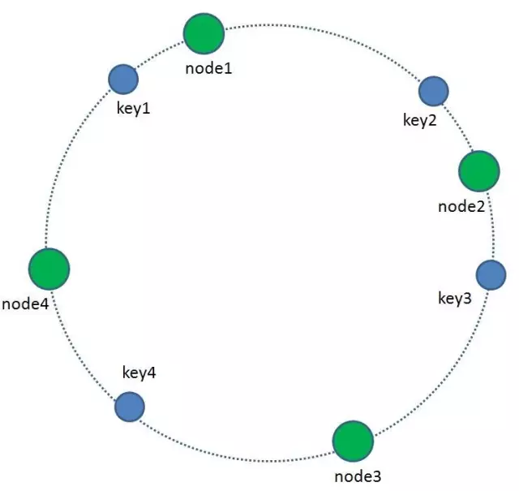
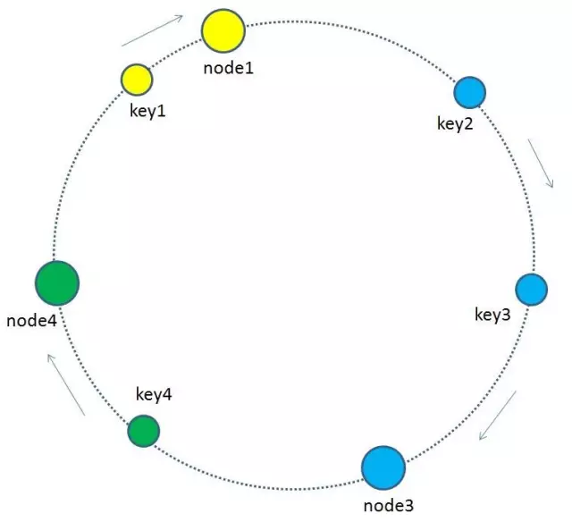
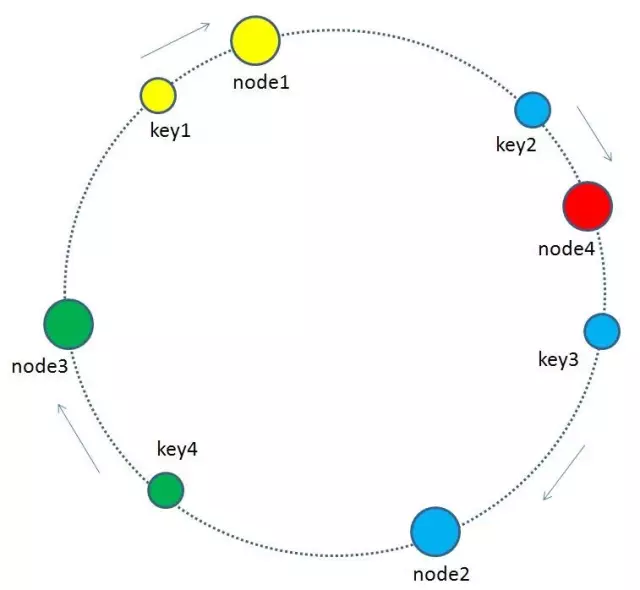
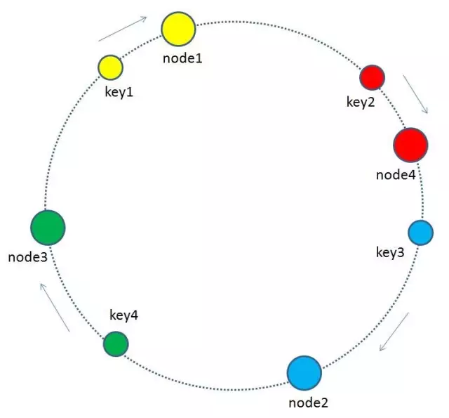
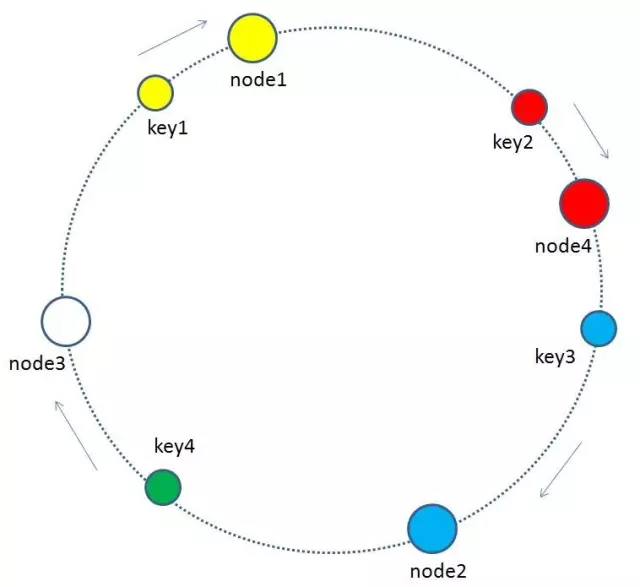
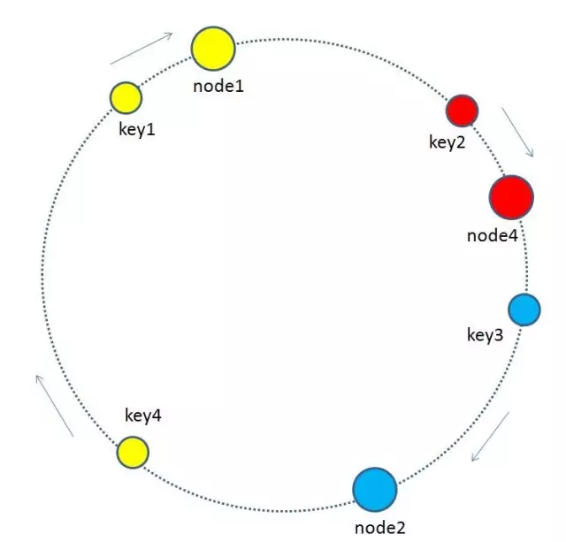
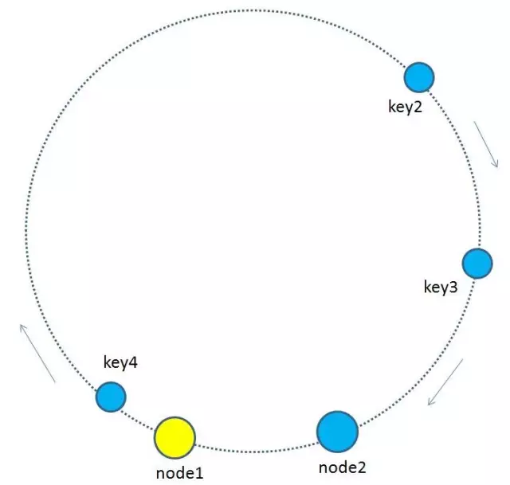
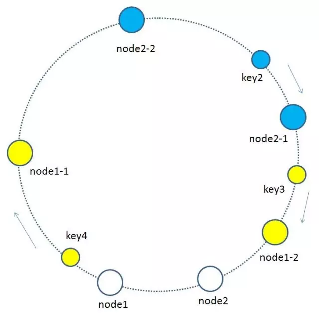

# 一致性哈希DHT consistent hashing

@@分布式 @@哈希 @@算法

## 算法

```bash
    NODE_HASH_SLOT = CRC16(node) mod 16384 # 实例所在的slot

    KEY_HASH_SLOT = CRC16(key) mod 16384 # key所在的slot
```

## 流程

1. C端连接集群任一node, 该node通过CRC16算出(或查询缓存的路由表)请求的key所在的实际node'
2. 若node'是自己, 直接执行命令并返回结果
3. 若node'是其他节点, 则返回C实际node'地址, C重定向请求

## 结构

1. 我们把全量的缓存空间当做一个环形存储结构。环形空间总共分成2^32个缓存区，在Redis中则是把缓存key分配到16384个slot。  
  

2. 每一个缓存key都可以通过Hash算法转化为一个32位的二进制数，也就对应着环形空间的某一个缓存区。我们把所有的缓存key映射到环形空间的不同位置。  
  

3. 我们的每一个缓存节点（Shard）也遵循同样的Hash算法，比如利用IP做Hash，映射到环形空间当中。  
  

4. 如何让key和节点对应起来呢？很简单，每一个key的顺时针方向最近节点，就是key所归属的存储节点。所以图中key1存储于node1，key2，key3存储于node2，key4存储于node3。  
  

## 增加节点

1. 当缓存集群的节点有所增加的时候，整个环形空间的映射仍然会保持一致性哈希的顺时针规则，所以有一小部分key的归属会受到影响。  
  

2. 有哪些key会受到影响呢？图中加入了新节点node4，处于node1和node2之间，按照顺时针规则，从node1到node4之间的缓存不再归属于node2，而是归属于新节点node4。因此受影响的key只有key2。  
  

> 最终把key2的缓存数据从node2过期失效, 重新生成在node4

## 删除节点

1. 当缓存集群的节点需要删除的时候（比如节点挂掉），整个环形空间的映射同样会保持一致性哈希的顺时针规则，同样有一小部分key的归属会受到影响。  
  

2. 图中删除了原节点node3，按照顺时针规则，原本node3所拥有的缓存数据就需要“托付”给node3的顺时针后继节点node1。因此受影响的key只有key4。  
  

> 最终key4的缓存数据随着node3消失而消失, 重新生成在node1  

## 虚拟节点  

1. 节点过少，容易出现所有key归为同一节点的情况  
  

2. 引入虚拟节点的概念，将原先的物理节点映射出N个子节点。使节点相对均衡。  
   1. 原`hash(192.168.1.109) -> node1`  
   2. 现`hash(192.168.1.109#1) -> node1-1`, `hash(192.168.1.109#2) -> node1-2`  
  

> 由于虚拟节点数量较多，缓存key与虚拟节点的映射关系也变得相对均衡了。  

## 判定算法好坏

### 平衡性 Balance

指哈希的结果能够尽可能分布到所有的缓冲中去，这样可以使得所有的缓冲空间都得到利用。  

### 单调性 Monotonicity

指如果已经有一些内容通过哈希分派到了相应的缓冲中，又有新的缓冲加入到系统中。哈希的结果应能够保证原有已分配的内容可以被映射到原有的或者新的缓冲中去，而不会被映射到旧的缓冲集合中的其他缓冲区。  

### 分散性 Spread

在分布式环境中，终端有可能看不到所有的缓冲，而是只能看到其中的一部分。当终端希望通过哈希过程将内容映射到缓冲上时，由于不同终端所见的缓冲范围有可能不同，从而导致哈希的结果不一致，最终的结果是相同的内容被不同的终端映射到不同的缓冲区中。这种情况显然是应该避免的，因为它导致相同内容被存储到不同缓冲中去，降低了系统存储的效率。分散性的定义就是上述情况发生的严重程度。好的哈希算法应能够尽量避免不一致的情况发生，也就是尽量降低分散性。  

### 负载 Load

负载问题实际上是从另一个角度看待分散性问题。既然不同的终端可能将相同的内容映射到不同的缓冲区中，那么对于一个特定的缓冲区而言，也可能被不同的用户映射为不同 的内容。与分散性一样，这种情况也是应当避免的，因此好的哈希算法应能够尽量降低缓冲的负荷。  
