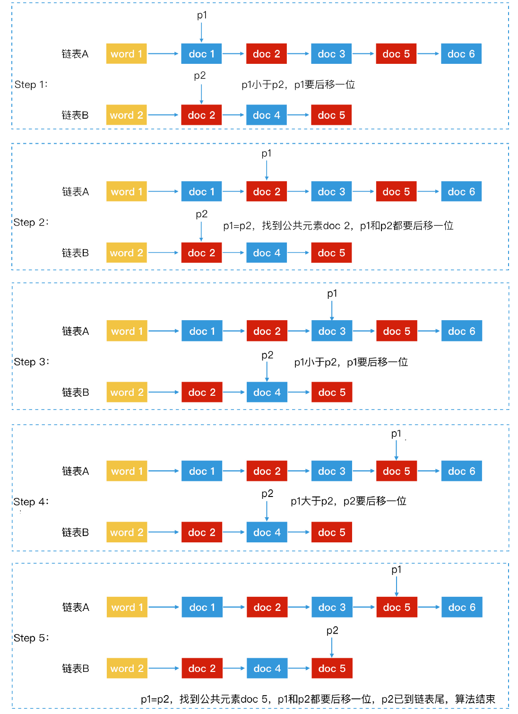
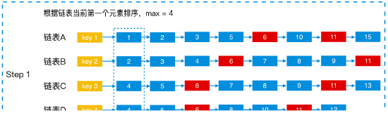
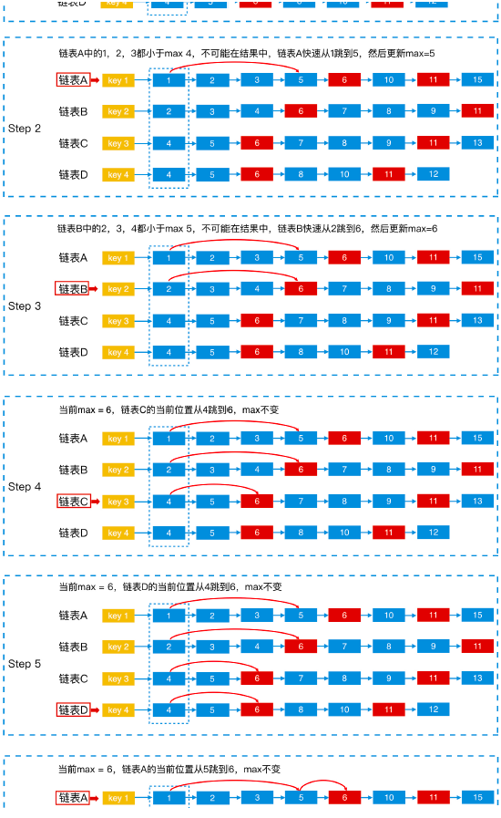
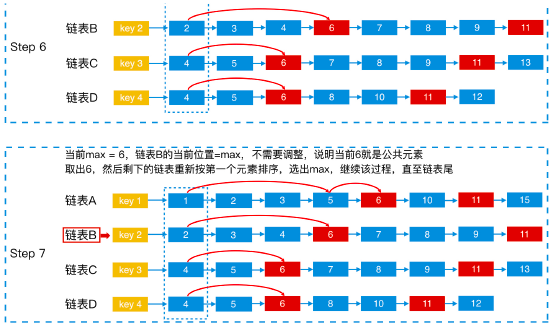
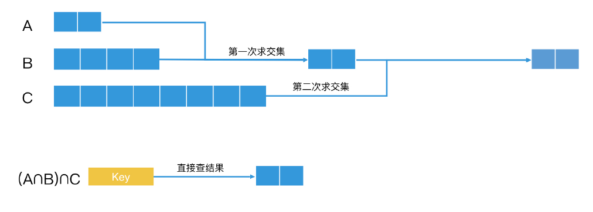
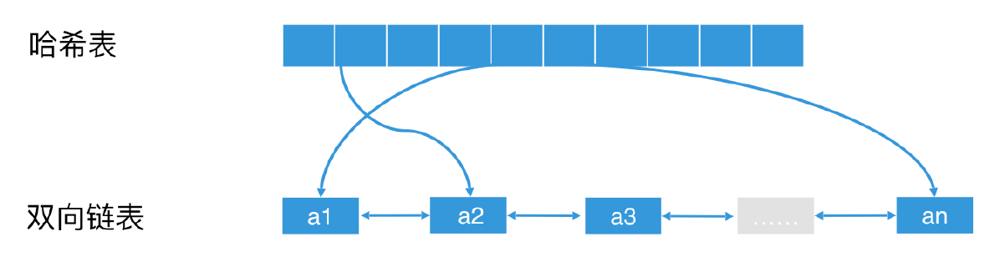

# 归并排序

## 概念

    将未排序的链表划分为n个子链表
    `子链表`间`逐个元素对比排序`后合并
    递归地进行上一步操作，最终得到一个排序后的链表

> `子链表` 子链表内永远是有序的  
> `逐个元素对比排序` 两个链表长度分别为 m 和 n 。若无序，两层遍历进行排序O(m*n)；若有序，逐个元素对比，将较小的元素push到新链表 `O(m+n)`  

## 特征

- `速度稳定`

- `适用于总体无序，各子项有序`

## 时间

- `optimal` O(n*log(n))
- `worst` O(n*log(n))
- `avg` O(n*log(n))

## 空间

O(n)

## 操作

  

## 优化 排序

- `有序链表 -> 跳跃表`

  
  

      a <1, 2, 3, ..., 999>
      b <1, 500, 888>

      链表: O(a+b)          # 在a中找500不用遍历了 O(498)
      跳跃表: O(log(a))     # 利用a跳表的索引 log(498)

- `有序链表 -> 跳跃表 互相二分查找`

   

      a <1, 3, 4, 6, ..., 999>
      b <8, ..., 888>

      跳跃表: 只列用了a的跳表。 O(log(a))
      跳跃表互相二分查找: 当元素a0 < b0, 以b元素做key在a中利用跳表的索引快速往前跳，反之亦然。 O(log(min(a, b)))

- `有序链表 -> 1哈希+1有序链表`

   

      a <1,2,3,4, ..., 999>
      b <1, 500, 888>

      链表: O(a+b)         
      哈希a 链表b: 当b中元素很少，a中元素很多时，可以将a转化为hash，遍历b中每个元素去a的hash中进行查询，由于hash查询是O(1)，所以整体是O(b)

- `有序链表 -> bitmap`

      a <1,2,3,4, ..., 999>
      b <1, 500, 888>

      链表: O(a+b)         
      bitmap: 当a, b元素间隔稠密且长度有限(便于分配空间)时，a, b都转化为bitmap，进行求交、并、补 O(1)。

## 优化 求交、并、补

- `调整顺序`

      多个集合进行求交、并、差（多路归并）（联合查询）时，当abc的个数有较大差异，(a ∩ b) ∩ c 和 a ∩ (b ∩ c) 速度有差异，但都是O(n)。

- `快速多路归并`

      利用跳跃表的特性加快多路归并的效率
      如a, b, c, d四个有序链表求交集
      1. 将4个链表第一个元素取出，其中最大一个元素记为max变量
      2. 从a开始，如果当前位置的值小于max，则用**跳表法**快速将指针调整到a中第一个 >= max 的元素位置。新位置元素若 > max，则更新max。
      3. b, c, d依次执行上一步操作。

    
    
    

- `预先联合`

      若 a ∩ b ∩ c 经常查询，可以预先将a_b_c作为key，交集的结果作为值记录在[倒排索引](ds-inverted-index.md)的posting list ，查询时直接查询。

    

- `缓存加速`

      多个`预先联合`+LRU （least recently used）
      一个简单LRU: 链表head插入缓存元素，tail淘汰元素；为了快速查询，在向链表head插入元素的同时，也向哈希插入key，对应的value是链表中这个节点的地址。

    
