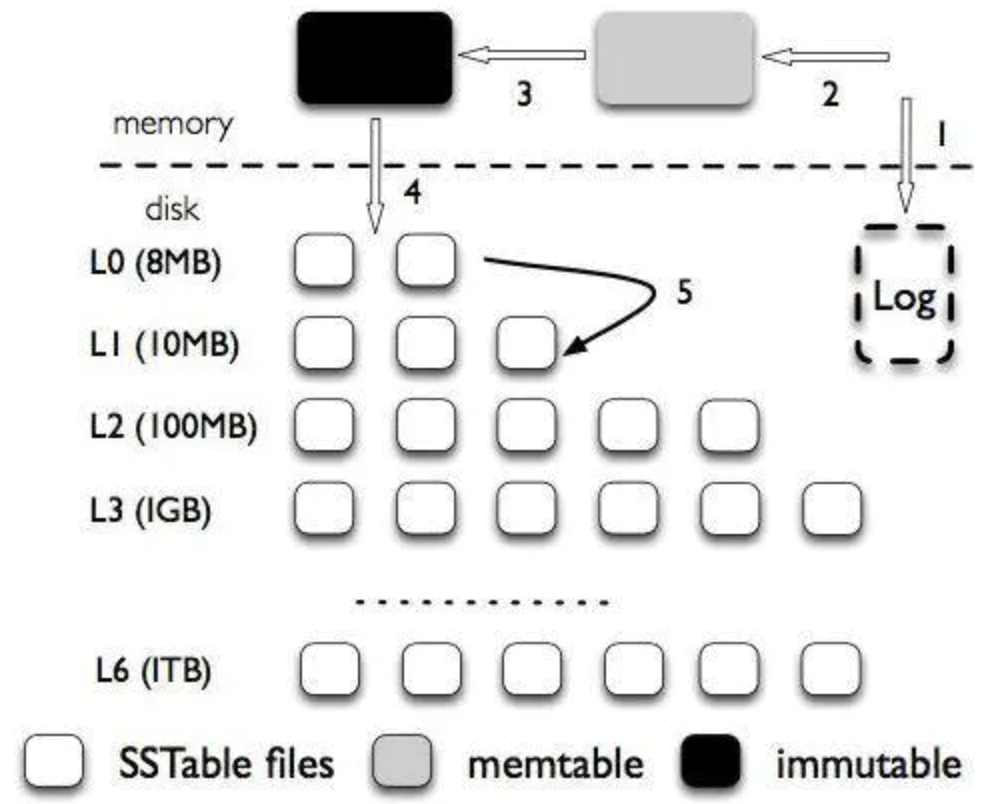

# LSM log-structured-merge

    先写内存, 数据写满后, 逐层滚动地归并 排序 写入磁盘.

- `内存` 内存数据, 一般32M

- `Memtable` 内存写满后创建(分配)新的内存Memtable继续写; 按key组织的[跳表SkipList](ds-skiplist.md)

- `Immutable` 每个Memtable写满32M的内存就转化成Immutable; 跟Memtable区别就是他只读, 不可再写

- `SSTable` sorted string table 磁盘数据(多层); 由Immutable写入 并 逐层合并; 最终数据有序地写入连续的磁盘

> 整块Immutable写入SSTable, 所以是顺序写

> `SSTable`一共7层(L0~L6), 每层比上一层大10倍; 每层都会重新排序

## 特性

- `批量写入` 单次多页顺序写( 而非B+的多次单页随机写 ), 写效率极高.

- `存储延迟` 可异步归并; WAL 保障可用性

## 操作

- `insert O (k*log n)`

  1. 追加写前日志 WAL(解决了可靠性)
  2. 写入Memtable 和 Immutable
  3. 后台线程将Immutable数据复制到L0 并 释放Immutable内存
  4. L0占内存较多时, C0与C1归并排序生成new-C1, 替换old-C1. -- 这个过程称为 Compaction, 可稍后异步完成.
  5. L1占磁盘较多时, C1与C2归并排序生成new-C2, 替换old-C2.
  6. L2占磁盘较多时...

> 写放大: 用户插入1k数据, 通过上述流程实际可能插入10k数据 和 多次IO.

> 数据写入L0时直接写, 并不会检查Key是否已经存在

- `find O (k*log n)`
  
  1. 先查内存
  2. 若没查到这个key, 则逆序遍历SSTable文件.
  3. SSTable的内容有序, 所以二分法 log N, 逐个遍历SSTable文件, 所以 k*log N
     1. check MEM L0
     2. check DIST L1
     3. check DIST L2
     4. check DIST L3

> 优化: [bloom filter](algo-bloomfilter.md)快速得到是否在当前层, 替代二分查找.

> 读放大: 用户读取1k数据, 通过上述流程实际可能读取10k数据 和 多次IO.

- `delete`

## 对比

### vs b+tree

    相比b+tree, LSM更擅长写入, 更劣于读取

## 实例

- `RocksDB存储引擎` 读写速度与redis同量级; FB开源; CockroachDB, MyRocks等多种数据库可以使用这个存储引擎
- `Etcd (BoltDB)`

## ref

> `https://blog.csdn.net/u014774781/article/details/52105708`

> `https://www.jianshu.com/p/5c846e205f5f`
