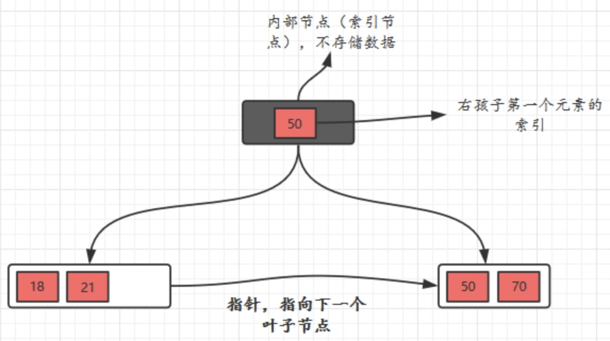

# b+tree

    基于平衡二叉树
    每个节点可拥有多个子节点
    中间节点不存储value(数据)，只存储key(索引)，value都在叶子节点里。
    某中间节点左子树key < 某中间节点的key <= 某中间节点右子树key
    每个叶子节点都有兄弟叶子的指针
    设某个b+tree为 m 阶b+tree
    m/2 <= k <= m-1 (同btree)

> [二叉树](ds-binary-tree.md)  
> [二叉搜索树](ds-binary-search-tree.md)  
> [平衡二叉树](ds-AVL-tree.md)
> [b-tree](ds-b-tree.md)

## 特征

- `中间节点不存储value(数据)，只存储key(索引)，value都在叶子节点里`
- `某中间节点左子树key < 某中间节点的key <= 某中间节点右子树key`
- `每个叶子节点都有兄弟叶子的指针`
- `一般每个中间节点的大小限定为磁盘一个簇的大小, 充分优化磁盘碎片空间`

> 磁盘最小读写单位是扇区，操作系统一次会最少读写多个扇区，这些扇区称为 块 block/簇 cluster

## 操作

- `find O(log n)` 拿着key在树中进行二分查找。

- `insert O(log n)`

      先定义这是 m 阶树，如m=5
      由叶子插入，当节点的元素大于阶时（即 k > m-1），从中间元素分裂，并把中间元素作为父元素。

      []3[]8[]11[]31[]              原始

            []11[]                  插入23，使其大于5阶，从中间元素11分裂，并把中间元素作为父元素。
            /    \
      []3[]8[]    []11[]`23`[]31    

            []11[]                  继续插入24，27，使其大于5阶
            /    \
      []3[]8[]    []11[]23[]`24`[]`27`[]31    

            []11[]24[]              从中间元素24分裂，并把中间元素作为父元素。
            /   |    \
      []3[]8[]  |     []24[]27[]31[]
                []11[]23[]

- `delete O(log n)`

      先定义这是 m 阶树，如m=5
      删除后必须 k >= ceil(m/2)-1，即 最终k >= 2结束删除。
      否则若兄弟(左右皆可)k > ceil(m/2)-1，则移动兄弟节点给自己，并更新父节点的key。
      若兄弟不足，则当前节点和兄弟节点合并，并删除父节点的key。

              []5[]15[]24[]           原始，删除10
            /    |    \
      []1[]2[]3[]|     []15[]20[]
                 []5[]10[]

              []3[]15[]24[]           兄弟节点足够，则移动兄弟的3给自己，并更新父节点key3
            /    |    \
      []1[]2[]   |     []15[]20[]
                 []3[]10[]

              []3[]15[]24[]           继续删除10
            /    |    \
      []1[]2[]   |     []15[]20[]
                 []3[]

             []15[]24[]               10的兄弟节点不足，则当前节点和兄弟节点合并，并删除父节点。
            /      \
      []1[]2[]3[]   []15[]20[]

## 对比

### vs B-tree

- 优势

1. 因为节点中无数据，单一节点存储的元素更多，树更低矮，IO更少。(实践中 3层就可以千万级别数据)
2. 所有查询都要从根查到叶子节点，速度更稳定。
3. 叶子节点链表，便于范围（遍历）查找 和 临近数据查找。

> 一个4k节点的内部可以存400个元素，那么一个4层的B+tree能存400^4=256亿个元素。

- 劣势

1. b+tree由于数据在叶子节点，每次插入新数据都需要随机写入磁盘，速度慢。 --- [LSM](ds-LSM.md)将多次单页随机写变成一次多页顺序写。

### vs mysql

1. 每个节点的大小等于磁盘一个簇的大小(4k)
2. 前3层中间节点常驻在内存中

> 第一层4k，第二层400^4k = 1.6M，第三层160000^4k = 640M

## ref

> `https://segmentfault.com/a/1190000020416577`
