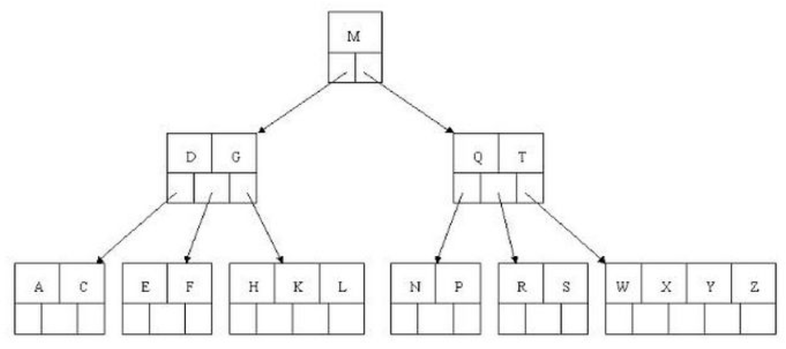

# 平衡多路查找树 b-tree



    基于平衡二叉树
    每个节点可拥有多个子节点
    每个子节点包含 k 个 key(即索引) 和 多路/阶(k+1路)
    每个节点都有key(索引)和value(数据)
    设某个b-tree为 m 阶b-tree
    m/2 <= k <= m-1


## 特征

- 每个节点可包含k个key:value 和 k+1路数据
- 查询中间节点数据速度较快
- 擅长主键查询, 不擅长条件查询和遍历

## 操作

- `find O(log n)` 通过key在树中进行二分查找.

- `insert O(log n)`

```bash
      # 先定义这是 m 阶树, 如m=5
      # 由叶子插入, 当节点的元素大于阶时(即 k > m-1), 向上进行节点合并.

      []3[]8[]11[]31[]            #原始

              []11[]
              /    \
      []3[]8[]    []`23`[]31[]    #插入23

              []11[]
              /    \
      []3[]8[]    []23[]`29`[]31[]`50`[]

                []11[]29[]
              /      |     \
      []3[]8[] []23[]`28`[] []31[]50[]   #插入28, 使其大于4时(5 > 5 -1), 29向上进行节点合并.
```

- `delete O(log n)`

```bash
      #先定义这是 m 阶树, 如m=5
      #中间节点: 用后继(右儿子)key替换要删除的key.
      #叶子节点: 删除后必须 k >= ceil(m/2)-1, 即 最终k >= 2结束删除.
              #否则若兄弟(左右皆可)k > ceil(m/2)-1, 则父节点key下移, 兄弟节点key上移.
              #若兄弟不足, 则父亲下移, 叶子合并.

              []22[]27[]30[]       #原始
              /    
      []13[]17[]21[]             

              []22[]27[]30[]       #删除(叶子节点)21, 删除后 k >= 2.完成删除.
              /  
      []13[]17[]                 


              []22[]27[]30[]       #原始
              /   |    \   \
      []13[]17[]  |     \
                  |      []28[]29[]  
                  []23[]24[]26[]  

              []22[]28[]30[]       #删除(中间节点)27, 用后继key28替换.
              /   |    \           #而此时叶子节点key不满足结束条件.
      []13[]17[]  |     \
                  |      []29[]     
                  []23[]24[]26[]  

              []22[]26[]30[]       #兄弟足够多, 则兄弟26上移替换父亲, 父亲28下移补充叶子.完成删除.
              /   |    \   \
      []13[]17[]  |     \
                  |      []28[]29[] 
                  []23[]24[]


              []22[]30[]           #若此时删除23, 由于兄弟不够, 只能父亲下移合并叶子.完成删除.
              /   |    \
      []13[]17[]  |                
                  |                
                  []24[]26[][]28[]29[] 
```

## 对比

### vs 平衡二叉树

1. 降低了树高, 即提升了查询交互次数

### vs B+Tree

1. 每个节点都有数据, 数据只出现在一个节点, 搜索有可能在中间节点结束 (这种情况比B+tree快)
2. 自动层次控制
3. 遍历性能比B+tree差

## 实战

- MongoDB的默认索引WiredTiger使用b-tree

## ref

- [二叉树](ds-binary-tree.md)  
- [二叉搜索树](ds-binary-search-tree.md)  
- [平衡二叉树](ds-AVL-tree.md)
- `https://zhuanlan.zhihu.com/p/24309634`  
- `https://www.oschina.net/question/565065_86338`  
- `https://zhuanlan.zhihu.com/p/27700617`  
- `https://www.cnblogs.com/nullzx/p/8729425.html`  
