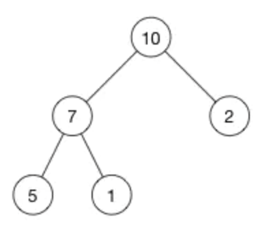

# 堆 heap



[ 10, 7, 2, 5, 1 ]

| node | index | parent index | left child | right child |
| ---- | ----- | ------------ | ---------- | ----------- |
| 10   | 0     | -1           | 1          | 2           |
| 7    | 1     | 0            | 3          | 4           |
| 2    | 2     | 0            | 5          | 6           |
| 5    | 3     | 1            | 7          | 8           |
| 1    | 4     | 1            | 9          | 10          |

    数组形式的二叉树
    最大堆: 父节点 > 子节点, 子节点无序
    最小堆: 父节点 < 子节点, 子节点无序

    parent(i) = floor((i - 1)/2)
    left(i)   = 2i + 1
    right(i)  = 2i + 2

> index 0 没有父节点, 故记为 -1

## 场景

    求最大最小值
    空间有限

## 特征

- `insert O (log n)` 常用

```bash
#       [ 10, 7, 2, 5, 1 ] 插入16, 变为 [ 10, 7, 2, 5, 1, 16 ]
          10
         /   \
        7     2
       / \   /
      5   1 `16`

#      交换2和16
          10
         /   \
        7     `16`
       / \   /
      5   1 2

#      交换16和10
          `16`
         /   \
        7     10
       / \   /
      5   1 2
```

- `delete`
  - `delete-root O(log n)` 常用
  - `delete O(n)`

- `find O(n)`

## 操作

## 对比

### vs 二叉树

- 节点顺序:

      二叉树 左子节点 < 当前 < 右子节点;
      堆 最大堆 左右子节点都 < 当前, 
      堆 最小堆 左右子节点都 > 当前, 

- 内存:

      二叉树 除数据外, 需要额外空间存储指针
      堆 只占用一个数组.

- 平衡:

      二叉树 平衡才能 O (log n)
      堆 不必平衡即可 O (log n)

    > 堆 每层填满才可以填下一层.

- 操作:

      二叉树 搜索快 插入、删除慢
      堆 搜索慢 插入、删除快

## 实战

- `构建优先队列`

- `快速找出一个集合中最大/小值`

## ref

- `https://www.jianshu.com/p/6b526aa481b1`
