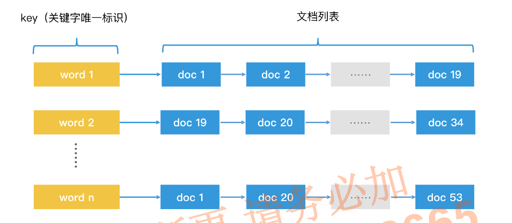
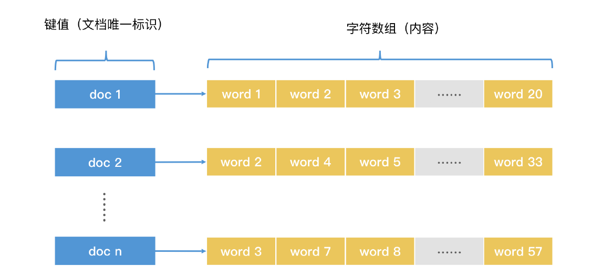

# 倒排索引 inverted index

    正排索引（forward index）: 根据key查找内容
    倒排索引（inverted index）: 根据内容的关键词查找key

> 常常与 [归并排序](algo-sort-merge.md) 相关

## 场景

        根据关键内容（tag）找key。

## 特征

- `有序性` 结果集为有序链表(or 跳跃表、数组)，便于结果集间求交集、并集、差集

## 结构

- 倒排索引

  

```bash

      word14 -> < doc1, doc2 ... > # 包含该word的doc的有序链表，方便与其他链表求交集、并集、差集 

      word77 -> < doc2 ... >
      ...

      # 倒排索引 扩展记录word在doc中的位置
      word14 -> < doc1_0, doc2_2 ... >

      word77 -> < doc2_0, doc2_3 ... >
      ...
```

> key的集合称作`字典 dictionary`，后面对应文档集合称作`记录列表 posting list`

- 正排索引

```bash
  

      doc1 -> [ word14, word27, word33 ... ]  # 全部内容的数组，每个元素是一个词

      doc2 -> [ word77, word312, word14, word77 ... ]
```

## 操作

- `find O(1)`

## 实战

- `经常查询包含word1和word2的doc` [归并排序](algo-sort-merge.md) 的预先联合查询 + 倒排索引
