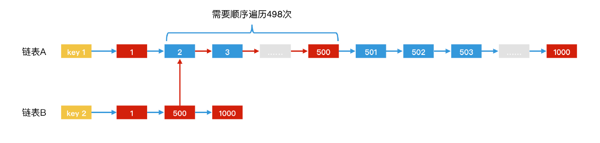
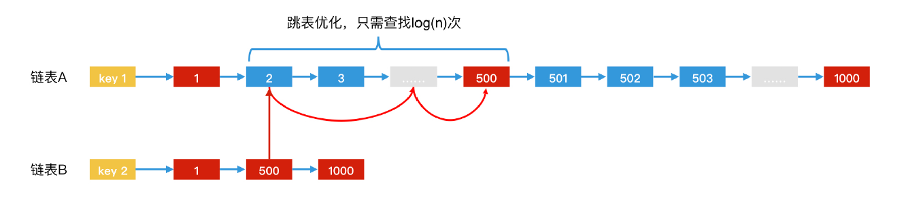
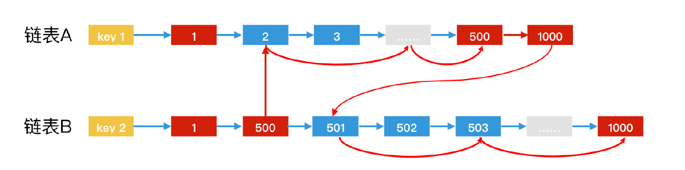
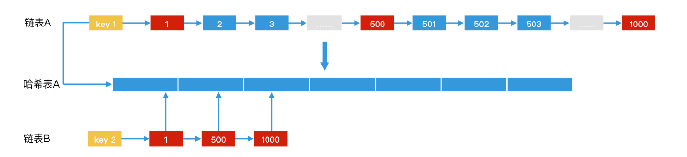

# 倒排索引 inverted index

## 概念

    正排索引（forward index）: 根据key查找内容
    倒排索引（inverted index）: 根据内容的关键词查找key

## 特征

- `有序性` 结果集为有序链表(or 跳跃表、数组)，便于结果集间求交集、并集、差集

## 结构

    //正排索引
    doc1 -> [ word14, word27, word33 ... ]  # 全部内容的数组，每个元素是一个词
    doc2 -> [ word77, word312, word14, word77 ... ]

    //倒排索引
    word14 -> < doc1, doc2 ... > # 包含该word的doc的有序链表，方便与其他链表求交集、并集、差集
    word77 -> < doc2 ... >
    ...

    //倒排索引 扩展记录word在doc中的位置
    word14 -> < doc1_0, doc2_2 ... >
    word77 -> < doc2_0, doc2_3 ... >
    ...

> 在 -> 左侧 都是hash的key  
> 在 -> 右侧 都是hash的内容 有序链表形式

## 操作

- `find O(1)`

## 实战

- `查询包含word1和word2的doc` 倒排索引+[归并排序](algo-sort-merge.md)

## 优化

- `有序链表 -> 跳跃表`

  
  

      a <1, 2, 3, ..., 999>
      b <1, 500, 888>

      链表: O(a+b)          # 在a中找500不用遍历了 O(498)
      跳跃表: O(log(a))     # 利用a跳表的索引 log(498)

- `有序链表 -> 跳跃表 互相二分查找`

   

      a <1, 3, 4, 6, ..., 999>
      b <8, ..., 888>

      跳跃表: 只列用了a的跳表。 O(log(a))
      跳跃表互相二分查找: 当元素a0 < b0, 以b元素做key在a中利用跳表的索引快速往前跳，反之亦然。 O(log(min(a, b)))

- `有序链表 -> 1哈希+1有序链表`

   

      a <1,2,3,4, ..., 999>
      b <1, 500, 888>

      链表: O(a+b)         
      哈希a 链表b: 当b中元素很少，a中元素很多时，可以将a转化为hash，遍历b中每个元素去a的hash中进行查询，由于hash查询是O(1)，所以整体是O(b)

- `有序链表 -> bitmap`

      a <1,2,3,4, ..., 999>
      b <1, 500, 888>

      链表: O(a+b)         
      bitmap: 当a, b元素间隔稠密且长度有限(便于分配空间)时，a, b都转化为bitmap，进行求交、并、补 O(1)。
