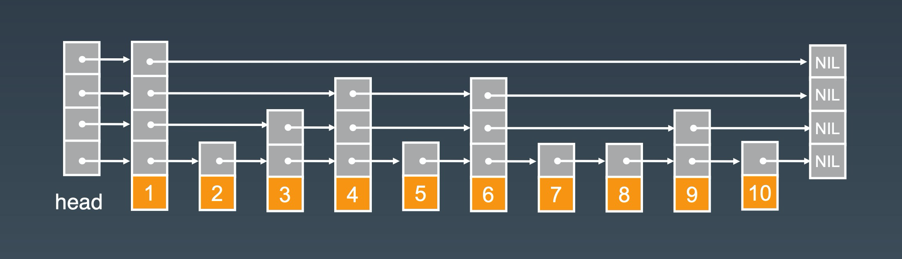

# 跳表 skip list

    多重索引的有序链表

## 场景

    优化链表查询速度
    数据(member)和其数值(score), 需要对score范围查找

## 特征

- `有序` 范围查找

## 结构

    SKIP_LIST {
        NODE head; # 表头
        int level; # 层级
    }

    NODE {
        data; # 数据

        # 每个元素表示该层下一个node的地址
        # next[1]是第1层的下一个node地址, next[2]是第2层的下一个node地址...
        # null表示末尾
        NODE []next; # 节点
    }

## 操作

- `find O(log n)`

- `insert O(log n)`

- `delete O(log n)`

## 实战

- redis zset

## ref

- [深入理解Redis跳跃表的基本实现和特性](https://juejin.cn/post/6893072817206591496)
