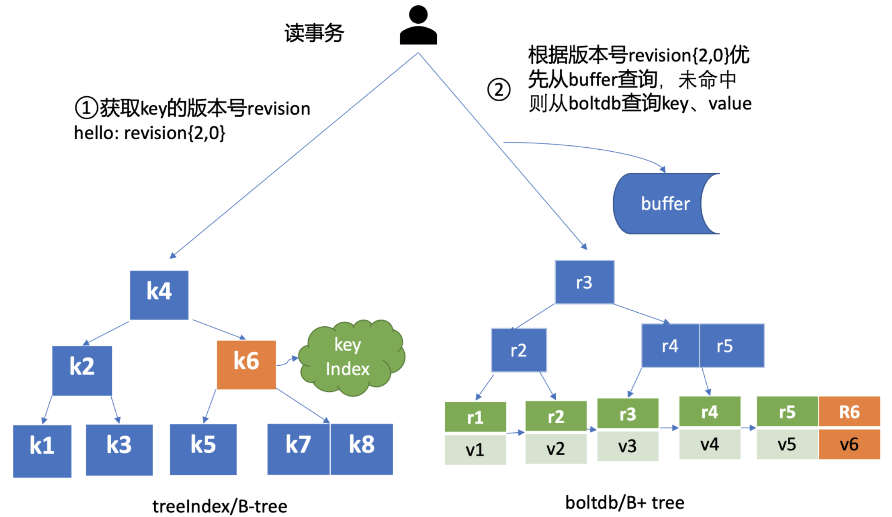

# etcd read

## 流程

```go
--------------------------------------------------------
| `Client层`     etcdctl/clientv3                       |
--------------------------------------------------------
--------------------------------------------------------
| `API层`                                               |
| gRPC-API                                             |
--------------------------------------------------------
--------------------   ----------------------------------
| `Raft层`          |  | `Logic层`                        |
|                  |   | KVServer                        |
| Read-Index       |   |                                 |
|                  |   | TreeIndex                       |
--------------------    ---------------------------------
----------------------------------------------------------
| `存储层`                                                 |
| boltDB                                                  |
----------------------------------------------------------
```

1. `client`
2. `gRPC-API`
   - 负载均衡Round-robin轮询
3. `KVServer`
   1. 拦截器中间件
      - debug日志
      - metrics统计
      - 请求参数校验
   2. 执行前集群必须有Leader(防止脑裂)
   3. 慢日志
4. `Read-Index` 实现线性读
5. `treeIndex` 内存B-tree索引; 查询key对应的版本号
6. `boltDB` KV持久化存储; B+tree; 查询版本号对应的值(值的结构为key-value)

## 串行读 Serializable

    直接读状态机数据, 无需通过 raft 协议与集群进行交互

- `高效率` 无需raft层
- `高吞吐` 无需raft层
- `低一致性` 在复制流程 [ 超半数节点持久化成功 -> 日志标记为已提交 -> 异步获取已提交日志应用到状态机 ] 中, 日志已提交, 但读取的是少半数节点, 则会读到旧数据

## 线性读 (默认)

    1. 节点x收到请求, 访问Leader获取当前已提交日志索引(committed index)
    2. 等待x节点状态机赶上Leader进度. 即:已应用索引(applied index) >= Leader已提交索引(commited index)
    3. 通知读请求可以去状态机访问数据了

- `低效率` 经过raft层的`Read-Index`
- `低吞吐` 经过raft层的`Read-Index`
- `高一致性`

## MVCC = TreeIndex + boltDB



1. 从treeIndex(B-tree)查询key对应的版本号
2. 查询版本号对应的值(值的结构为key-value); 先从buffer(内存二分查找)查询; 若未命中再从boltDB(B+tree)查询
   - key: {version}
   - val: {key}{value}