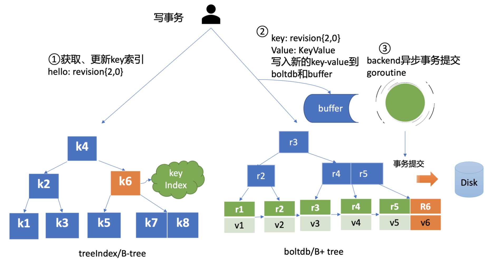

# etcd read

## 流程

```go
--------------------------------------------------------
| `Client层`     etcdctl/clientv3                       |
--------------------------------------------------------
--------------------------------------------------------
| `API层`                                               |
| gRPC-API                                             |
--------------------------------------------------------
--------------------   ----------------------------------
| `Raft层`          |  | `Logic层`                        |
|                  |   | Quota                           |
| Read-Index       |   |                                 |
|                  |   | KVServer                        |
|                  |   |                                 |
|                  |   | Auth                            |
|                  |   |                                 |
|                  |   | Apply                           |
|                  |   |                                 |
|                  |   | treeIndex                       |
--------------------    ---------------------------------
----------------------------------------------------------
| `存储层`                                                 |
| WAL                                                     |
| boltDB                                                  |
----------------------------------------------------------
```

1. `client`
   - 负载均衡Round-robin轮询
2. `gRPC-API`
3. `Quota`
   - 检查空间占用
4. `KVServer`
   - 拦截器中间件
   - 预检preflight check
   - 发起提案proposal
   - 广播给所有Follower进行持久化和应用到状态机
5. `WAL`
   - 持久化
   - 超半数持久化后, raft模块通过channel通知etcdserver提案已提交(committed)
6. `Apply`
   - 异步执行已提交的提案
7. `treeIndex`
8. `boltDB`

> 对比读流程 额外涉及`Quota` `WAL` `Apply`三个模块

## Quota 检查空间占用

### `etcdserver: mvcc: database space exceeded` 报错

- `原因` db配额不足, 默认2G, 导致集群只读不可写入
- `解决`
  - 调整配额(quota-backend-types)
  - 取消警告(etcdctl-alarm-disarm)
  - 开启etcd压缩(compact); 压缩回收只是打标记复用空间, 不会减少占用
  - 磁盘碎片整理(defrag)可以减少占用

## KVServer

### `preflight check` 预备检查

- 限速 已提交日志索引(committed index) - 已应用状态机日志索引(applied index) > 5000
  - err `etcdserver: too many requests`
- 鉴权 校验token
  - err `auth: invalid auth token`
- 大包 写入的包大小 > 1.5MB
  - err `etcdserver: request is too large`

### `proposal` 提案

1. 生成唯一ID
2. ID关联一个对应的消息通知channel
3. 向raft模块发起提案Proposal
4. 阻塞等待结果, 结果会通过消息通知channel返回 or 超时
   - 默认超时7s = 5s磁盘IO延时 + 2s竞选超时
   - err `etcdserver: request timed out`

## WAL

### `数据结构`

- `Type 日志类型`
  - 文件元数据记录 (在WAL创建时写入)
  - 节点ID
  - 集群ID
- 日志条目记录
  - `raft日志信息`(如put提案内容)
- 状态信息记录 (一个日志中会有多条, 以最后一条为准)
  - 集群的任期号term
  - 节点投票信息
- CRC记录
  - 记录上一个WAL文件的最后的CRC信息 (在创建, 切割WAL文件时用到), 用以校验完整性
- 快照记录
  - 快照的任期号term
  - 日志索引

- `CRC 校验码`

- `Data 日志条目`

### `恢复`

- etcd重启时从WAL解析出raft日志条目内容, 追加到raft日志存储中, 并Apply模块重放已提交的日志提案

## Apply

### 幂等性

- raft日志条目中的index表达了日志条目的唯一性, 对应唯一一个提案, 执行过的index会原子的保存到db

> consistent index 保存在boltDB的meta桶中

## MVCC = TreeIndex + boltDB



### TreeIndex

从treeIndex(B-tree)查询key对应的版本号

### boltDB

序列化版本号对应的值(值的结构为key-value)为二进制数据; 先保存到buffer(以供快速读取); 再保存到boltDB(B+tree)

- 格式
  - key: {version}
  - val:
    - key名称
    - key创建时的版本号 create_revision
    - 最后一次修改的版本号 mod_revision
    - key自身修改的次数 version
    - value
    - 租约信息

> boltDB写磁盘(fsync)并非立刻执行, 而是异步(默认每隔100ms)批量事务一次性提交来提高QPS和吞吐

> pending事务过多会触发同步提交事务

> 版本号为一个全局唯一自增数字, currentVersion但只存储在内存, 重启etcd后通过枚举遍历得到currentVersion