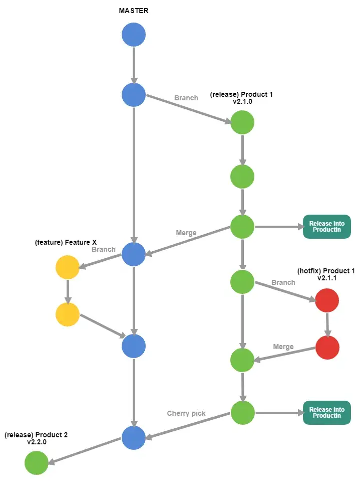

# gitlab-flow

## branch

## production

1. A `Production` branch is created from `master`
1. `Production` is synchronize with online

### pre-production / release

1. `Pre-production` branches is created from `master`
1. `Pre-production` branch contains all versions that need to release to online
1. When branch test or bug fix is complete it is merged into the `master` and `production` branch

### master

1. The `main` branch is developing branch

### feature

1. `Feature` branches are created from `master`
1. When a `feature` is complete it is merged into the `master` branch

## compare with git-flow

1. 适用于版本的延迟发布 (例如: iOS 应用审核到通过中间，可能也要在 master 上推送代码)
1. 适用于不同环境的部署 (例如: 测试环境, 预发环境, 正式环境)
1. 适用于不同版本发布与修复 (只有一个 master 分支真的不够用)

## tips

1. 若额外建立dev分支(从master中检出, 包含所有开发中的功能), dev与master不可直接merge, 而应该每个feature单独merge to dev/master