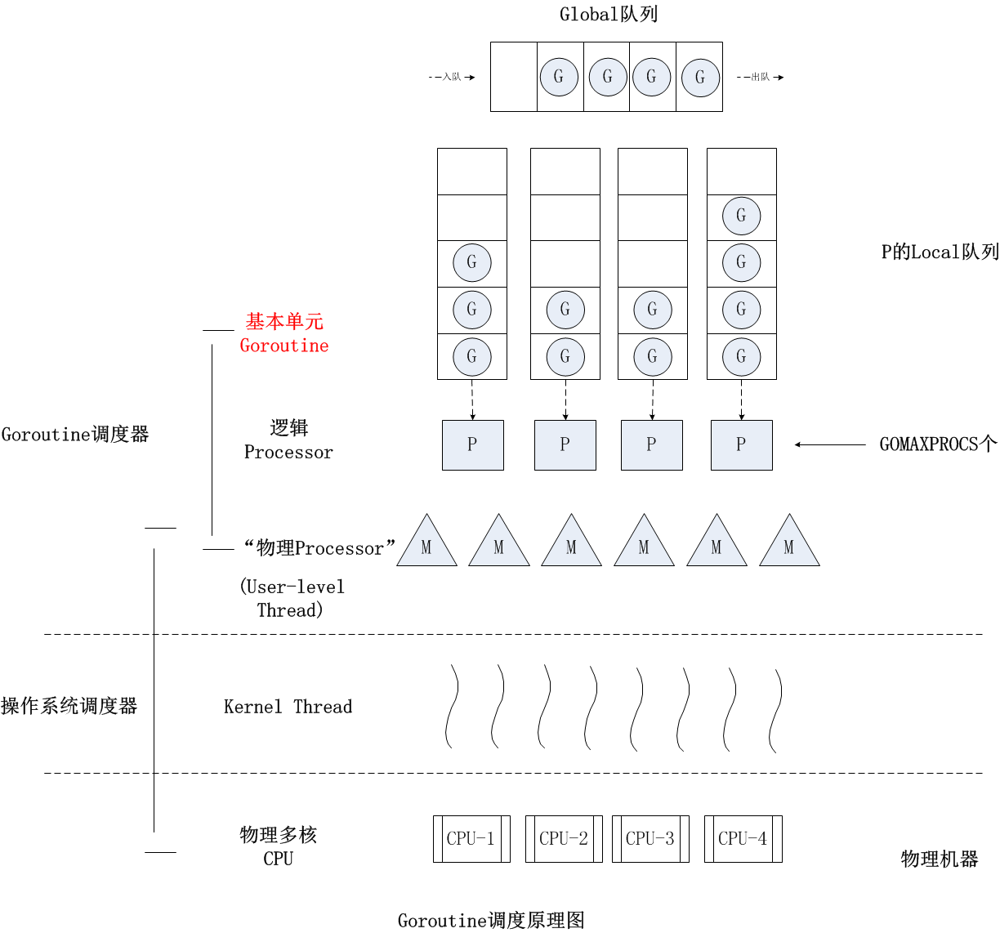
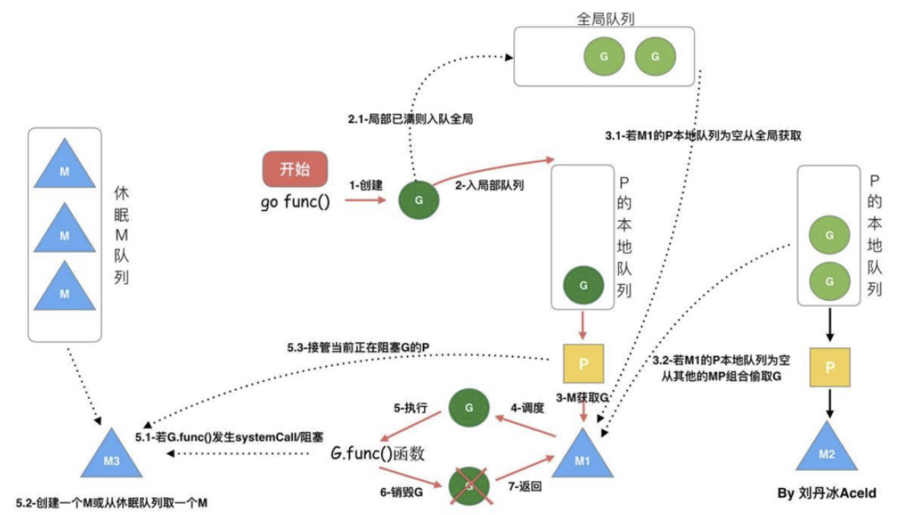

# 调度过程  

  



## 复用线程

### work-stealing 机制; 偷取

```bash
    # P2空闲 && global-queue为empty, P2进入自旋状态
        =>|             |=> # GQ G的全局队列
        G5
        G4
        G3
        G2

        P1 -- G1     P2
        M1           M2(自旋)

    # P2从P1-queue偷走G 后一半的G, 并结束自旋
        =>|             |=> # GQ
        
        
        G3          
        G2           `G5`

        P1 -- G1     P2 -- `G4`
        M1           M2(结束自旋)
```

### hand-off 机制; 放手

        G阻塞时, 调休眠中/新调出的M接管P和P的队列, 继续执行

```bash
    # G1阻塞, 导致P1M1不干活儿了
        =>|        M2 M5|=> # MQ M休眠队列

        =>|             |=> # GQ


        G2           G3

        P1 -- G1     P2
        M1           M2

    # 如果MQ有休眠中的M: MQ中取出并唤醒M5, 将P1转移到M5, 继续执行G2
    # 如果MQ没有休眠中的M: syscall新建M3, 将P1转移到M3, 继续执行G2
        =>|           M2|=> # MQ

        =>|             |=> # GQ


                     G3

                     P2      `P1` -- `G2`
        M1--G1       M2       M5
      (sleep)

        # > G1阻塞结束后, 会回到其他队列 or 全局队列等待执行

    # G1执行完毕后, M1重新唤醒(非阻塞), 会优先夺回原配P1
    # 若P1有G, 则其次从PQ中取; 若PQ为空, 则M1休眠回到M  Q
        =>|        P4 P3|=> # PQ P的空闲队列
        =>|           M2|=> # MQ
        =>|             |=> # GQ


                     G3

                     P2      `P1` -- `G2`
        M1           M2       M5
      (wakeup)

```


## 利用并行

```bash
    调整P的个数 最多个数GOMAXPROCS可配置
    根据CPU占用进行调整 如: CPU/2
```

## 抢占

```bash
    # 协程 协作
    # cr0时间到后, `通知调度器`, 调度器根据自己的算法逻辑进行调度cr1, 然后继续cr0未完成的部分
        Thread0    |----| |----| |----|
                   cr0     cr1    cr0       # cr=协程 co-routine

    # go-routine 抢占
    # gr0时间到后 gr0标记为"可让位", 供其他gr4`主动抢占` (不通知调度器)
        Thread0    |----| |----| |----|  ... |----|
                   gr0    gr4    gr7         gr0       #cr=go-routine

    # gr占用的时间片固定10ms
```

## 全局G队列

```bash
    # P2空闲
        =>|        G4 G5|=> #GQ

        
        G3
        G2             

        P1 -- G1     P2
        M1           M2

    # P2优先从全局队列中获取G, 此过程需加锁解锁
    # (若全局队列empty, 则自旋偷取其他P-queue)
        =>|           G4|=>   # GQ; lock/unlock 带锁获取

        
        G3
        G2

        P1 -- G1     P2 -- `G5`
        M1           M2
```

---

## 场景

### G1创建的G

- `行为` G1创建的G3, 会优先加入G1所在的P-queue
- `目的` 享受局部性资源

```bash
    # P1 P2 empty queue, G1创建G3


        P1 -- G1     P2 -- G2
        M1           M2

    # G3固定出生在P1-queue (G1所在的P-queue)
       `G3`

        P1 -- G1     P2 -- G2
        M1           M2
```

### G1执行完毕

- `行为` G1执行完, 会优先执行P1-queue中的G(由G0调度)
- `目的` 享受局部性资源

```bash
    # G1被执行完毕后, 切换为G0绑定P1
        G5
        G3           G4

        P1 -- G1     P2 -- G2
        M1           M2

    # G0会优先调度当前队列(P1-queue)的G3

        G5           G4

        P1 -- `G3`   P2 -- G2
        M1           M2
```

### P-queue满时继续创建G

- `行为` 当P1-queue已经满了, G1继续创建G', 会将P1-queue的前一半G随机打乱顺序后, 与G'一起放到Global-queue
- `目的` 防止饥饿

```bash
    # P1-queue已满了, 此刻G1创建新的G7
        =>|             |=> # GQ
        G6
        G5
        G4
        G3           

        P1 -- G1     P2 -- G2
        M1           M2

    # (队头)G7与P1-queue的前一半G随机顺序后放入Global-queue
    # 若再创建G8, 会正常放入P1-queue
        =>|     G4 G7 G3|=> # GQ


        G6
        G5

        P1 -- G1     P2 -- G2
        M1           M2
```

### 唤醒休眠的M, 并自旋获取or偷取

- `行为` 当G1创建G, 就会尝试唤醒休眠的M2
- `目的` 防止饥饿

```bash
    # G1创建G6时, 若M休眠队列中有M, 则会取出一个M
        =>| M4 M2|=> # MQ M休眠队列

        =>|  G10 G9 G8 G7|=> #GQ
        
        G5
        G4
        G3           

        P1 -- G1   
        M1         

    # M2被唤醒, 生成P2, M自旋并通过M0偷取
    # 若受GOMAXPROCS限制, 没有生成P2, 则M2重新休眠
        =>|    M4|=> # MQ M休眠队列

        =>|  G10 G9 G8 G7|=> #GQ
       `G6`
        G5
        G4
        G3           

        P1 -- G1    P2 -- M0
        M1          M2(自旋)

    # M自旋时 优先从global-queue获取, 其次从其他P-queue偷取. 获取/偷取后停止自旋
    # 从全局队列获取个数 n = min(len(GQ)/GOMAXPROCS + 1, len(GQ/2)) # GQ 全局队列G个数 # 简单理解为拿小一半
    #      - 从global-queue 到 P-queue的过程叫做负载均衡
    # 从其他P-queue偷取 queue的后一半G (过程同work-stealing
        =>|    M4|=> # MQ M休眠队列

        =>|        G10 G9|=>
       `G6`
        G5
        G4         `G8`
        G3         `G7` 

        P1 -- G1    P2 -- M0
        M1          M2(结束自旋)

```


## issues

### 偷取为什么不用加锁?

        todo

### 资源消耗

        销毁 > 自旋 > 创建 > 队列中取
        自旋比较消耗资源, 但销毁更浪费资源, 不如让M短期自旋, 尝试获取/偷取G

### 阻塞

        IO
        select
        block on syscall
        channel
        等待锁
        runtime.Gosched()

### Sysmon

    Sysmon也叫监控线程, 周期性的检查变动
        >5min span物理内存闲置, 则强制释放
        >2min没有GC, 则强制GC
        长时间未处理netpoll, 则添加到全局队列
        >10ms的Goroutine会进行抢占调度(retake)
        长时间因syscall阻塞的P, 则回收

---

## 单M  

        单P绑定单M, 顺序执行G

## 多M  

        多P绑定多M, 并行执行G

## 多M多P  

- 如果我们在一个Goroutine中通过go关键字创建了大量G, 这些G虽然暂时会被放在同一个队列, 但如果这时还有空闲P(系统内P的数量默认等于系统cpu核心数), Go运行时系统始终能保证至少有一个(通常也只有一个)活跃的M与空闲P绑定去各种G队列去寻找可运行的G任务, 该种M称为自旋的M.一般寻找顺序为: 自己绑定的P的队列, 全局队列, 然后其他P队列.如果自己P队列找到就拿出来开始运行, 否则去全局队列看看, 由于全局队列需要锁保护, 如果里面有很多任务, 会转移一批到本地P队列中, 避免每次都去竞争锁.如果全局队列还是没有, 就要开始玩狠的了, 直接从其他P队列偷任务了(偷一半任务回来).这样就保证了在还有可运行的G任务的情况下, 总有与CPU核心数相等的M+P组合 在执行G任务或在执行G的路上(寻找G任务).  

## G中存在阻塞IO, 阻塞了M执行  

      Go探测到G1阻塞了M 则将其P转移到其他M (包含G2G3G4...)
      当M阻塞完毕
        M重新寻找一个P去执行G1, 
        若当前无空闲P, 则G1回到Global


> `详细` 在这种情况下, 这个M将会被内核调度器调度出CPU并处于阻塞状态, 与该M关联的其他G就没有办法继续执行了, 但Go运行时系统的一个监控线程(sysmon线程)能探测到这样的M, 并把与该M绑定的P剥离, 寻找其他空闲或新建M接管该P, 然后继续运行其中的G, 大致过程如下图所示.然后等到该M从阻塞状态恢复, 需要重新找一个空闲P来继续执行原来的G, 如果这时系统正好没有空闲的P, 就把原来的G放到全局队列当中, 等待其他M+P组合发掘并执行.  

## 如果某一个G在M运行时间过长, 有没有办法做抢占式调度, 让该M上的其他G获得一定的运行时间, 以保证调度系统的公平性  

- 我们知道linux的内核调度器主要是基于时间片和优先级做调度的. 对于相同优先级的线程, 内核调度器会尽量保证每个线程都能获得一定的执行时间.为了防止有些线程"饿死"的情况, 内核调度器会发起抢占式调度将长期运行的线程中断并让出CPU资源, 让其他线程获得执行机会. 当然在Go的运行时调度器中也有类似的抢占机制, 但并不能保证抢占能成功, 因为Go运行时系统并没有内核调度器的中断能力, 它只能通过向运行时间过长的G中设置抢占flag的方法温柔的让运行的G自己主动让出M的执行权.
- 说到这里就不得不提一下Goroutine在运行过程中可以动态扩展自己线程栈的能力, 可以从初始的2KB大小扩展到最大1G(64bit系统上), 因此在每次调用函数之前需要先计算该函数调用需要的栈空间大小, 然后按需扩展(超过最大值将导致运行时异常).Go抢占式调度的机制就是利用在判断要不要扩栈的时候顺便查看以下自己的抢占flag, 决定是否继续执行, 还是让出自己.  
- 运行时系统的监控线程会计时并设置抢占flag到运行时间过长的G, 然后G在有函数调用的时候会检查该抢占flag, 如果已设置就将自己放入全局队列, 这样该M上关联的其他G就有机会执行了.但如果正在执行的G是个很耗时的操作且没有任何函数调用(如只是for循环中的计算操作), 即使抢占flag已经被设置, 该G还是将一直霸占着当前M直到执行完自己的任务.  

## 对网络IO的优化  

- 将标准库中的网络库全部封装为非阻塞形式, 防止其阻塞底层的M并导致内核调度器切换上下文带来的系统开销.
- 运行时系统加入epoll机制(针对Linux系统), 当某一个Goroutine在进行网络IO操作时, 如果网络IO未就绪, 就将其该Goroutine封装一下, 放入epoll的等待队列中, 当前G挂起, 与其关联的M可以继续运行其他G.当相应的网络IO就绪后, Go运行时系统会将等待网络IO就绪的G从epoll就绪队列中取出(主要在两个地方从epoll中获取已网络IO就绪的G列表, 一是sysmon监控线程中, 二是自旋的M中), 再由调度器将它们像普通的G一样分配给各个M去执行.  
  

## ref

- Golang深入理解GPM模型 <https://www.bilibili.com/video/BV19r4y1w7Nx?p=12&spm_id_from=pageDriver&vd_source=1092dd19ba71837a4fbb1ad282ee1357>
- go休养之路 <https://www.yuque.com/aceld/golang/ga6pb1>
- Golang 调度器 GMP 原理与调度全分析 <https://learnku.com/articles/41728>

