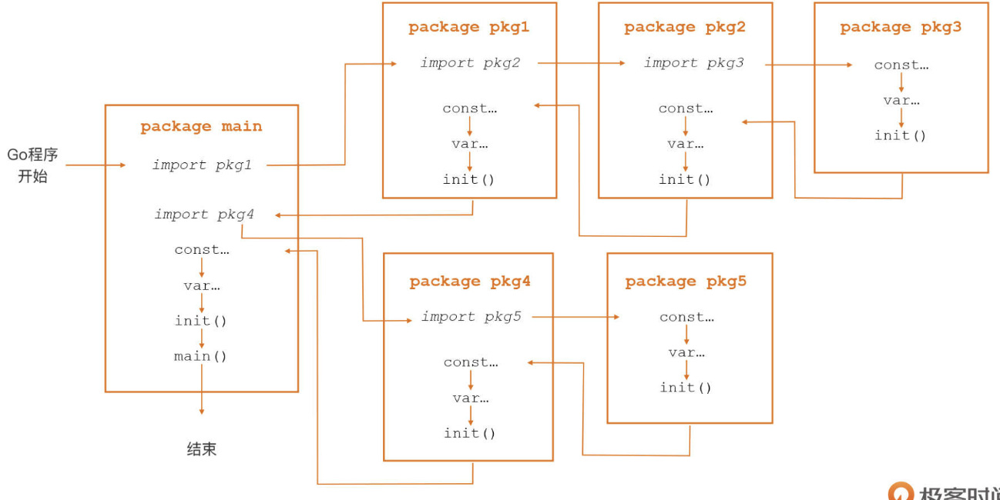

# go import

## 导入

```go
// 单行导入
import "path1"   // 注意: 这里是路径, 而非包名
import "path2"

// 多行导入
import (
    "path1"
    "path2"
)
```

## 自定义包名

```go
import (
    "crypto/rand"
    mrand "math/rand" // 将名称替换为mrand避免冲突
)
```

## 指定主版本

```go
import "github.com/go-redis/redis/v7" // v7.x.x
```

## 匿名导入包

```go
import (
    _ "path/to/package" // 触发导入包的init()
)
```

## init() 包的初始化函数



```bash
func init() {

}
# 初始化顺序: 以深度优先的顺序. 如包的引用关系为 main->A->B->C, 则`init()`的调用顺序为 C.init->B.init->A.init->main

# 包内顺序: 常量 -> 变量 -> init()

# 同一个包的多个`init()`顺序随机

# `init()`不能被其他函数调用; 即在GO生命周期内只能调用一次; 报错推荐直接panic

# pkg1 pkg2 都依赖 pkg3, 则pkg3只会init()一次
```

### 用途1: 重置pkg级变量值

    var CommandLine先被初始化, 再通过init()重置Usage值, 作为默认实例
    即pkg通过var 和 init创建一个初始默认实例

```go
// src/flag/flag.go
var CommandLine = NewFlagSet(os.Args[0], ExitOnError)

func init() {
	CommandLine.Usage = commandLineUsage
}

func commandLineUsage() {
	Usage()
}

func NewFlagSet(name string, errorHandling ErrorHandling) *FlagSet {
	f := &FlagSet{
		name:          name,
		errorHandling: errorHandling,
	}
	f.Usage = f.defaultUsage
	return f
}

var Usage = func() {
	fmt.Fprintf(CommandLine.Output(), "Usage of %s:\n", os.Args[0])
	PrintDefaults()
}
```

### 用途2: 对pkg即变量的复杂初始化

```go
var (
    http2VerboseLogs bool // 初始化时默认值为false
    http2logFrameWrites bool // 初始化时默认值为false
    http2logFrameReads bool // 初始化时默认值为false
    http2inTests bool // 初始化时默认值为false
)
func init() {
    e := os.Getenv("GODEBUG")
    if strings.Contains(e, "http2debug=1") {
        http2VerboseLogs = true // 在init中对http2VerboseLogs的值进行重置
    }
    if strings.Contains(e, "http2debug=2") {
        http2VerboseLogs = true // 在init中对http2VerboseLogs的值进行重置
        http2logFrameWrites = true // 在init中对http2logFrameWrites的值进行重置
        http2logFrameReads = true // 在init中对http2logFrameReads的值进行重置
    }
}
```

### 用途3: 工厂模式

    sql包, pq包搭配使用, pq将实例注册进sql, sql.Open()最为工厂方法使用
    有效降低pq包对外的直接暴露

```go
import (
    "database/sql"
    _ "github.com/lib/pq"
)
func main() {
    db, _ := sql.Open("postgres", "user=pqgotest dbname=pqgotest")
    rows, err := db.Query("SELECT name FROM users WHERE age = $1", 21)
    ...
}

// src/github.com/lib/pq
func init() {
    sql.Register("postgres", &Driver{})
}
```

    image包的工厂模式

```go
import (
    "fmt"
    "image"
    _ "image/gif" // 以空导入方式注入gif图片格式驱动
    _ "image/jpeg" // 以空导入方式注入jpeg图片格式驱动
    _ "image/png" // 以空导入方式注入png图片格式驱动
    "os"
)

func main() {
    imageFile := ""
    f, _ := os.Open(imageFile) // 打开图文文件
    defer f.Close()
    img, _, err := image.Decode(f) // 对文件进行解码，得到图片实例
    b := img.Bounds() // 对象可以获取图片宽高 b.Max.X, b.Max.Y
}
```