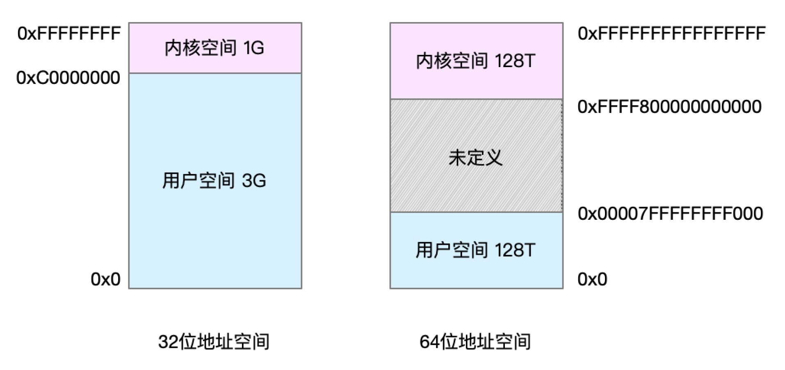
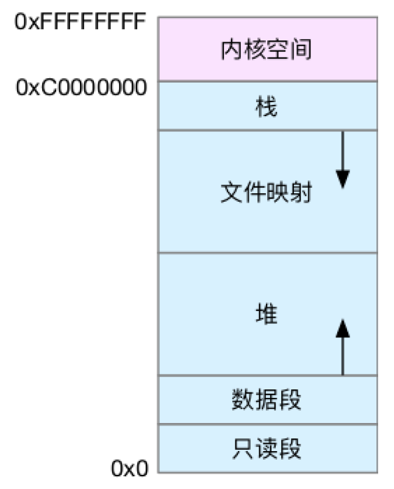
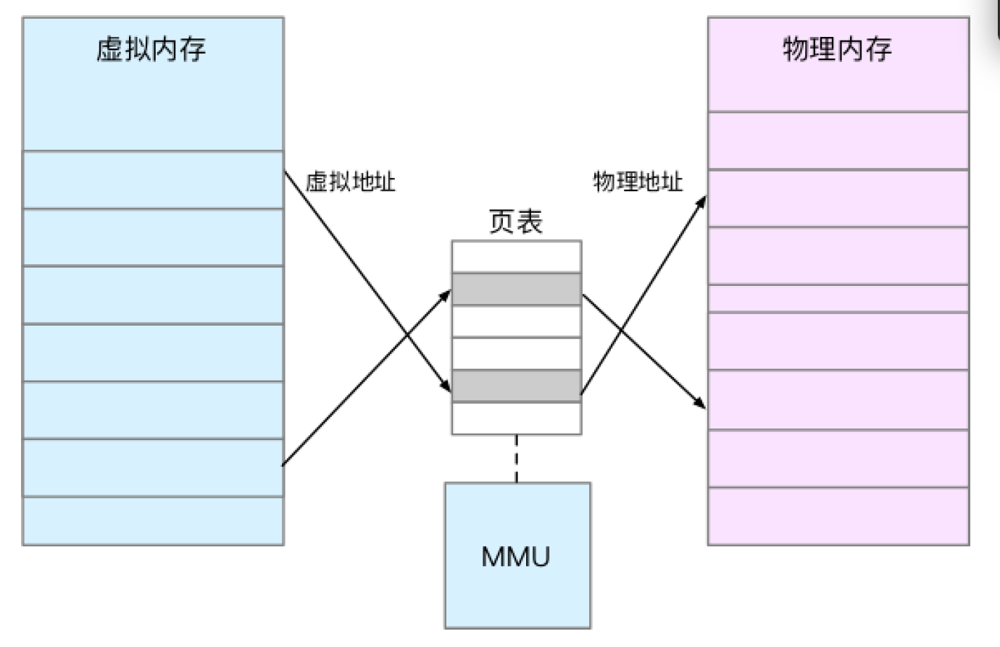
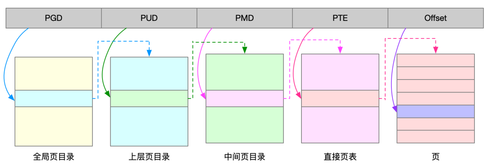

# 内存

## 物理内存

主存、动态随机访问内存(DRAM).由内核直接访问.

## 虚拟内存

每个进程各自都有一个大小与处理器寻址空间相等的虚拟内存空间, 且相互独立.

### 虚拟内存的内核态与用户态

1. 只读段, 包括代码和常量等.
2. 数据段, 包括全局变量等.
3. 堆, 包括动态分配的内存, 从低地址开始向上增长.
4. 文件映射段, 包括动态库、共享内存等, 从高地址开始向下增长.
5. 栈, 包括局部变量和函数调用的上下文等.栈的大小是固定的, 一般是 8 MB.

## 内存分页

记录虚拟地址与物理地址的映射.

### 存储

页表存储在主存中, 即CPU的内存管理单元MMU(Memory Management Unit)

- 页表缓冲 TLB(Translation Lookaside Buffer)

### 页

内存映射的物理内存的最小单位(一般是4k, 1字节的4096倍)；即最小数据也会占用4k物理内存.

### 缺页异常

进程访问的虚拟地址在页表中查不到, 产生*缺页异常*, 进入内核空间分配物理内存、更新进程页表、最后再返回用户空间、恢复进程的运行.

## 多级页表

划分为多级页表, 减少页表所需的空间.

### 大页 HugePage

## 分配与回收

### 分配

#### brk()

对于小块内存(<128k)使用brk()进行内存分配.  
通过移动堆顶位置来分配内存.

- 减少缺页异常, 提高内存访问效率.
- 内存释放后不立刻归还系统, 而是缓存起来重复利用.
- 内存工作繁忙时, 频繁内存分配和释放会造成内存碎片.

#### mmap()

对于大块内存(>128k)使用mmap()进行内存分配.  
通过在文件映射段找一段空闲内存分配.

- 释放时直接归还系统
- 每次都会发生缺页异常, 使内核的管理负担增大.

#### 内核slab

在内核空间, linux通过slab分配器来管理(分配和释放)小内存.

## 回收

### 主动

free(), unmap()

### 被动

- LRU回收缓存.
- 不常用的内存写入SWAP磁盘分区.
- OOM(out of memeroy)直接杀死大内存的进程.

## 指标

- total
- used 已经使用 包含共享内存
- free
- shared/SHR
- buffer 内核缓冲区用到的内存, 对应/proc/meminfo Buffers
- cache 内核页缓存和Slab用到的内存, 对应/proc/meminfo Cached+SReclaimable
- available
- VIRT 虚拟内存 只要进程申请就算
- RES 常驻内存 不包括swap和共享内存

### meminfo中的 Buffers 与 Cached

buffers 磁盘(块设备文件)的数据缓存(包含读和写)

cached 文件的数据缓存(包含读和写)
  
## ref

- [arm-linux学习-(MMU内存管理单元)](https://www.jianshu.com/p/abb4b5aeb83b)
- [Linux的内存分页管理](https://www.cnblogs.com/vamei/p/9329278.html)
- [内存耗用 VSS/RSS/PSS/USS](https://www.jianshu.com/p/3bab26d25d2e)
