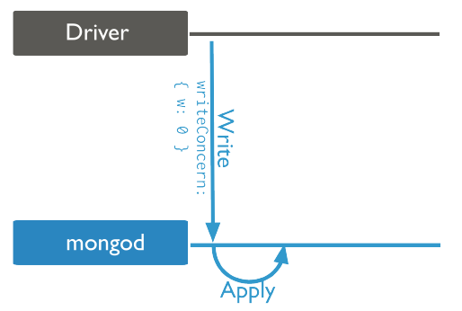
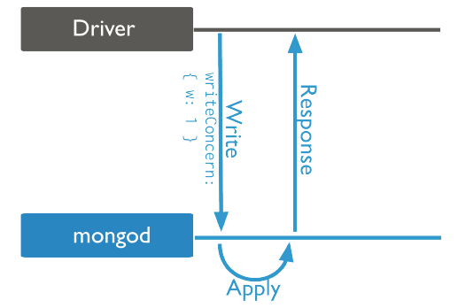
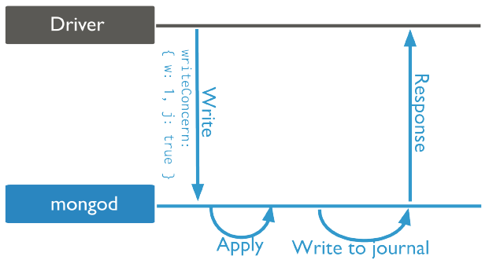
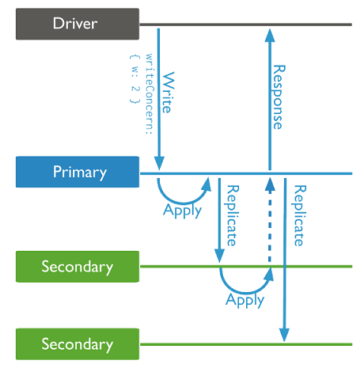

# MongoDB 事务

## 事务

| 事务属性 | 支持程度                                                |
| -------- | ------------------------------------------------------- |
| A        | 单coll单doc 1.x; 复制集多表多行 4.0;分片集群多表多行4.2 |
| C        | writeConcern, readConcern 3.2                           |
| I        | readConcern 3.2                                         |
| D        | journal + replicset                                     |

## 读优先级 Read Preference --- 从哪个节点读

### 分类

- primary(默认):  读Primary  --- 若该选项, RS中P挂了, 是不会故障转移的.
- primaryPreferred:  优先读P, 若P不可用, 再读S  
- secondary:  读Secondary  
- secondaryPreferred:  优先读S, 若S不可用, 再读P  
- nearest: 读最近的可达节点上(通过ping时间判定远近)  

### 场景

- p、pp 用户下单后立刻转到订单详情(s可能还没复制到数据).  
- s、sp 读历史订单(时效性低).  
- s 分析统计出报表(时效性低, 消耗资源大.避免影响线上用户).  
- n 全球性服务, 读用户上传的头像(时效性低, 就近读取).  

### 操作

- 连接串 `mongodb://host1:27017,host2:27017,host3:27017/?replicaSet=rs&readPreference=secondaryPreferred`
- 驱动API `MongoCollection.withReadPreference(ReadPreference readPref)`
- Mongo Shell `db.coll.find({}).readPref("secondaryPreferred")`

---

## 读事务 Read Concern

> `https://docs.mongodb.com/manual/reference/read-concern/`

### 分类

- available 读数据  
- local 读属于当前分片的数据 (非分片与available一样)
- majority 读多数节点已提交/不会被回滚的数据 --- 以MVCC机制实现, 避免脏读 --- 隔离级别 Read Committed
- linearizable 线性读  --- 只对单doc作用, 执行慢需配超时
- snapshot 读快照  


replicset更新一个数据, P、S1、S2分别读取到该数据的时间节点

| target | available、local | majority |
| ------ | ---------------- | -------- |
| P      | t0               | t3       |
| S1     | t1               | t5       |
| S2     | t2               | t6       |

### 场景

- available、local的区别
  
```md
数据(chunk x)从分片1(shard1)自动迁移到分片2(shard2)的过程中
如果此时聚合查询涉及shard2,则
- local 不包含x
- available 会包含x的脏数据

> 普通的读写依然会操作shard1 (config中依然记录着chunk属于shard1)
```

- majority避免脏读

```md
数据x写入P
读取P的x
P挂了
重新选举
- 非majority 读到的x是脏数据, 因为x已经从事务角度看发生了回滚
- majority 会等大多数节点有数据才读, 所以避免了脏读.
```

- 读写分离 写P后立刻从S读

```md
// w P + r S 可能读不到
db.order.insert({oid:123, d:xxx})
db.order.find({oid:123}).readPref("secondary")

// w: m + r: m 解决
db.order.insert({oid:123, d:xxx}, writeConcern:{w: majority})
db.order.find({oid:123}).readPref("secondary").readConcern("majority")
```

- lineariable避免脑裂读旧数据

```md
数据x=1; P, S1, S2发生脑裂, x=2写入S1(新的P)
- 非lineariable 还会对旧P进行读取值x=1
- lineariable 对旧P进行读取时, 会对其他进行确认x是否最新
```

- 事务隔离性

```md
db.tb.insert([{x:1},{x:2}])
var session = db.getMongo().startSession();
session.startTransaction();
var coll = session.getDatabase('test').getCollection('tb')
coll.update({x: 1}, {y: 123}) // 事务内更新
coll.find({x: 1}) // 事务内查询 x: 1 y: 123
db.tb.find({x: 1}) // 事务外查询 x: 1 `事务提交前, 事务外看不到事务内的操作, 体现事务隔离性.`
```

- 可重复读 repeatable-read

```md
db.tb.insert([{x:1},{x:2}])
var session = db.getMongo().startSession();
session.startTransaction({
    readConcern: {level: snapshot},
    writeConcern: {w: majority}
});
var coll = session.getDatabase('test').getCollection('tb')
db.tb.update({x: 1}, {y: 123}) // 事务外更新
db.tb.find({x: 1}) // 事务外查询 x: 1 y: 123
coll.find({x: 1}) // 事务内查询 x: 1 `事务内可重复读`
```

- 两个事务写冲突

```md
db.tb.insert([{x:1},{x:2}])
var session = db.getMongo().startSession();
session.startTransaction({
    readConcern: {level: snapshot},
    writeConcern: {w: majority}
});
var coll = session.getDatabase('test').getCollection('tb')

coll1.update({x: 1}, {y: 123}) // 事务1更新
coll2.update({x: 1}, {y: 456}) // 事务2更新 -> 报错, 该数据被另一事务占用 `两个事务悲观锁`

session1.commitTransaction(); // 事务1提交
coll2.update({x: 1}, {y: 456}) // 事务2更新 -> 依然报错, 该数据被另一事务占用
session2.abortTransaction(); // 抛弃事务2, 并重启事务(startSession())才可以 `两个事务冲突, 必须abort`

...coll3.update({x: 1}, {y: 999}) // 重启后的新事务正常修改
db.coll.update({x: 1}, {y: 1000}) // 阻塞等待事务3提交
session3.commitTransaction(); // 事务3提交,  事务外的修改立刻成功,  此时y = 1000 `事务外的修改 阻塞等待事务的commit 才能修改成功`
```

---

## 写事务 Write Concern

  
非应答写入Unacknowledged  - `{writeConcern:{w:0}}`  

- MongoDB不对客户端进行应答, 驱动会检查套接字, 网络错误等.  

  

应答写入Acknowledged(默认)  - `{writeConcern:{w:1}}`  

- MongoDB会在收到写入操作并且确认该操作在内存中应用后进行应答, 但不会确认数据是否已写入磁盘;同时允许客户端捕捉网络、重复key等等错误  

  

应答写入+journal写入Journaled  - `{writeConcern:{w:1, j:true}}`  

- 确认写操作已经写入journal日志(持久化)之后应答客户端, 必须允许开启日志功能, 才能生效.(w=写内存后返回,w+j=写内存+写日志后返回)  
- 写入journal操作必须等待直到下次提交日志时完成写入  
- 提供通过journal来进行数据恢复  

  

副本集应答写入Replica Acknowledged   - `{writeConcern:{w:2, wtimeout:5000}}`  - `{writeConcern:{w:majority, wtimeout:5000}}`  

- 对于使用副本集的场景, 缺省情况下仅仅从主(首选)节点进行应答  
- 可修改应答情形为特定数目或者majority(写到大多数)来保证数据的可靠  
  - primary是如何确认数据已成功写入大多数节点的？
    1. 从节点及时地拉取数据: 阻塞拉取  
       - 从拉取主的`oplog`时,  为了第一时间拉取, find命令支持一个awaitData的选项, 当find没有任何符合条件的文档时, 并不立即返回, 而是等待最多maxTimeMS(默认为2s)时间看是否有新的符合条件的数据, 如果有就返回.  
    2. 主节点同步拉取状态: Secondary应用完`oplog`会向主报告最新进度  
       - Secondary上有单独的线程, 当`oplog`的最新时间戳发生更新时, 就会向Primary发送replSetUpdatePosition命令更新自己的`oplog`时间戳.
    3. 当Primary发现有足够多的节点`oplog`时间戳已经满足条件了, 向客户端进行应答.  

> [oplog](mongodb-oplog.md)

## issues

1. `{w:majority, wtimeout:5000}` 写入副本集某些secondary时触发超时(or crash), primary写入成功, 某些secondary写入失败, 如何处理没数据的secondary？

## ref

[mongodb是如何实现ACID](https://blog.csdn.net/czq7511/article/details/77531903)