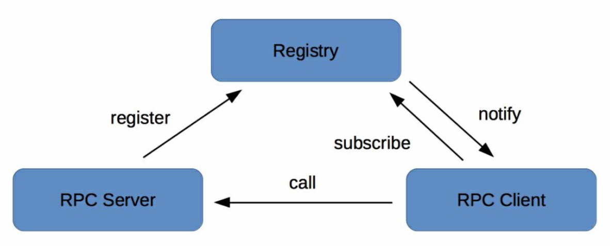

# 微服务 服务发现

## 概念

## 组成



### 服务端 RPC server

外提供后台服务，将自己的服务信息注册到注册中心

### 客户端 RPC client

注册中心获取远程服务的注册信息，然后进行远程调用

### 注册中心 registry

服务端注册远程服务以及客户端发现服务

#### API

```json
"Service" : { // 服务
    "Cluster1": { // 分组
        "K1": "V1" // 节点信息
        "K2": "V2"
    },
    "Cluster2": {},
    ...
}
```

- **注册**: server向registry注册
  - check whitelist exists, cluster exists, service exists
  - store
- **反注册**: server向registry撤销注册
  - check services exists, cluster exists
  - del node (删除节点信息)
  - update cluster sign
- **心跳**: server向registry发送心跳来完成节点存活状态上报。
- **获取**: client向registry获取最新可用server节点列表
  - localcache (本地内存)
  - snapshot (本地快照/持久化)
- **订阅**: client向registry订阅sign
  - check cluster sign
  - get from remote
  - update localcache
  - update snapshot
- **后台管理**
  - 查询: 查询registry当前注册了哪些服务
  - 修改: 修改registry某一服务信息

#### 部署

一般采用集群部署保障高可用性。如zookeeper

#### 健康检查

#### 服务状态变更通知

#### 白名单

只有registry白名单中存在的server才能注册。防止测试server节点意外跑到线上。

## ISSUES

### 多注册中心

问题：多注册中心  
解决：c要同时订阅多个r，s同时注册多个r

### 并行订阅服务

问题：串行订阅效率低  
解决：并行提高效率

### 批量反注册服务

问题：注册调用失败对服务无影响，反注册失败会让不可用节点残留在注册中心。  
解决：需要定期清理。

### 服务变更信息增量更新

问题：c向r对比sign，由于网络抖动，r的sign可能经常变动，导致c频繁从r全量拉取最新节点信息。  
解决：增量更新，r只返回节点信息变化值。
