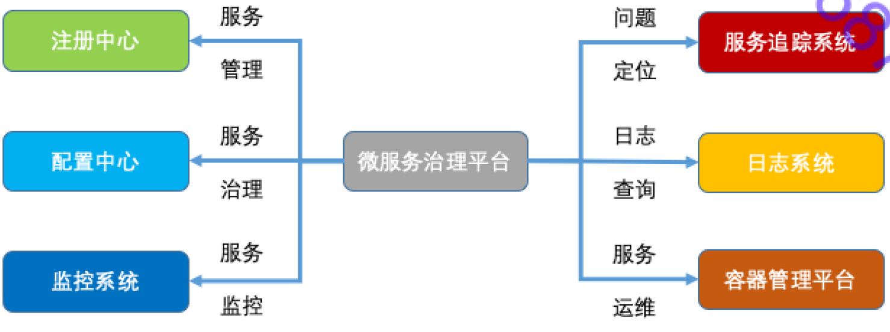

# 微服务 服务治理

## 节点管理

- `注册中心主动摘除机制` S主动向R汇报心跳, 心跳超时则R摘除该节点, 并将可用S节点列表推送给C.
  - 问题1 若R与S网络故障导致心跳超时, 但S是能正常提供服务的, 最差会导致R将S全部摘除(雪崩)
  - 解决1 设置阈值, 如20%, 一段时间内R不能摘除超过20%以上的节点.
  - 问题2 网络抖动导致可用节点不断变化, 大量C全量获取节点信息, 打满带宽.
  - 解决2 设置开关, 开启时, 即使网络抖动, R也不会通知所有C, 只给10%返回节点信息, 但这样会C感知节点信息的延迟加大.
  
- `服务消费者摘除机制` C对S进行存货探测, 心跳超时则标记该S节点不可用(仅标记在C自己内存).

## 负载均衡

- `随机` 均匀
- `加权轮询` 按硬件性能合理分配权重轮询
- `最少活跃` 以连接数选择调用最少节点
- `一致性hash` 相同参数的请求总发向同一节点, 某扩缩容或节点故障时, 原发往该节点的请求平摊到其他节点, 不会引起剧烈变动.

- `自适应最优算法(动态加权轮询)` C端维护一份与每个S的性能统计, 动态的将性能低的权重设低值, 性能好的权重设高值.

## 路由

### 路由 - 场景

- `业务灰度发布需求` 新功能部分用户先访问, 得到反馈后全量发布
- `多机房就近访问需求` 跨IDC多机房; 异地多活
- `流量切换` 不可抗力的故障, 将故障的a机房流量切换到安全的b机房
- `读写分离` 读、写部署在不同的节点

### 路由 - 规则

- `条件路由`
  - c与s映射 `host = 1.1.1.1 => host = 2.2.2.2`
  - 排除s节点; 所有访问不落在该IP `=> host != 1.1.1.1` 如: 线上排除预发布机器
  - 黑名单; 该IP不可访问 `host = 1.1.1.1, 2.2.2.2 =>`
  - 白名单; 仅该IP可访问 `host != 1.1.1.1, 2.2.2.2 =>`
  - 机房隔离; `host = 1.1.1.* => host = 1.1.1.*` 如: 同IP端一般为同地机房
  - 读写分离; `method = find*, list*, get* => host = 1.1.1.1` `method != find*, list*, get* => host = 2.2.2.2`

- `脚本路由`
  - JS、Python、golang等脚本路由

### 路由 - 方式

- `静态配置` C存储路由规则
- `动态配置` R存储路由规则

### 路由 - 获取

- `本地配置`
- `动态下发`
- `配置中心`

## 容错

- `FailOver` 失败自动切换 自动从可用节点选择下一节点请求
  - 场景 幂等、一般是读请求

- `FailBack` 失败通知 不重试, 只给通知
  - 场景 非幂等

- `FailCache` 失败缓存 不立刻重试, 而是隔一段时间再发起重试.
  - 场景 幂等、立刻重试可能会加剧问题.

- `FailFast` 快速失败 不重试
  - 场景 非核心业务

## 故障

- `集群故障` bug使资源消耗, 承载下滑; 突发流量冲击, 系统压垮.
  - 限流
    - 方式 并发请求量阈值.
    - 标准 QPS; 线程数
    - 参数 超时时间; 并发数
  - 降级
    - 方式 设置开关; 自动降级 (超时error, 并发error)
    - 标准 新增的业务; 按程度降级(如: 1级影响业务小 可自动; 2级影响业务 需手动; 3级对业务、收入、体验较大影响 手动)

- `单IDC故障`
  - 基于DNS切换流量
  - 基于RPC切换流量
    - 方式 修改路由

- `单机故障`
  - 重启
    - 方式 判定服务不可用, 摘除, 自动重启, 重新上线.
    - 标准 某接口平均耗时低于阈值则重启; 多接口采集平均耗时低于阈值则重启.

## 调用失败

- `设置超时`
  - 场景 服务调用迟迟没有返回结果, 可能将c端连接消耗殆尽.

- `重试`
  - 场景 服务调用失败偶发.

- `双发` 同时发出两次调用, 提高成功率和效率(接收先返回的结果); 备份请求(backup requests): 先调用, 超时时间P999, 没返回再发一个调用, 超时P90.
  - 场景 服务调用失败偶发.
  - 优化 备份请求要设置一个最大重试比例, 以避免增大压力, 如: 15%的请求进行双发.

- `熔断` 某段时间内调用失败次数(比率)达到阈值, 触发熔断, 后续调用直接降级.
  - 场景 s端故障短时间无法恢复.
  - 优化 半熔断,熔断n次后尝试正常调用.
  - 部署 熔断器部署在服务调用端.
  - 举例 20个请求中30%(6个请求)异常,则降级(给个默认响应),降级10次后尝试调用(关闭熔断)

## 配置中心

- `本地配置` 修改配置需要进行发布, 是很重的操作
  - 耦合 配置在代码库中, 随代码一同发布
  - 独立 抽离到单独库, 配置与代码分离
  
- `配置中心` 把服务配置、代码开关、服务降级开关、依赖资源等同一管理
  - 存储结构
  - 注册
  - 反注册
  - 查看
  - 订阅变更

## 服务治理平台

- `服务管理`
  - 服务上下线
  - 添加删除节点
  - 服务查询
  - 服务节点查询

- `服务治理`
  - 限流
  - 降级
  - 切流量

- `服务监控`

- `问题定位`

- `日志查询`

- `服务运维`
  - 发布
  - 扩缩容

## ISSUES

- r宕机
- s宕机
- c与r网络故障
- s与r网络故障
- c与s网络故障
- s性能变慢
- s短时间内不可用
