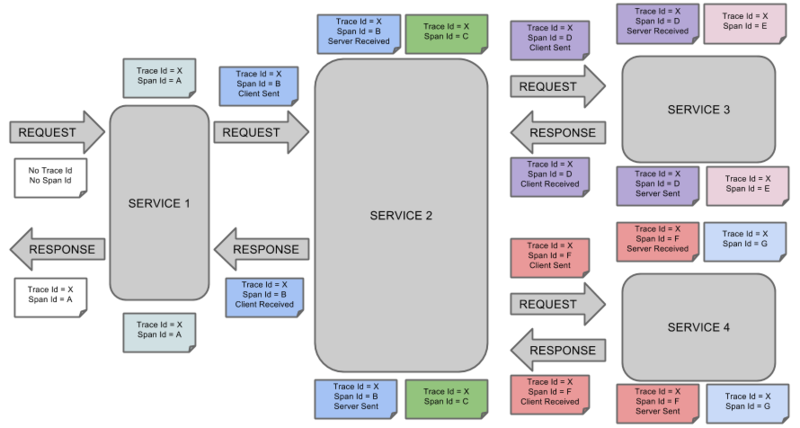

# 微服务 服务追踪

    跟踪记录⼀次⽤户请求都发起了哪些调⽤, 经过哪些服务, 并记录每⼀次调⽤涉及服务的详细信息, 若调⽤失败, 可以通过这个⽇志快速定位问题.

## 作用

- `优化系统瓶颈`
- `优化链路调用`
- `生成网络拓扑`
- `透明数据传输` 参数传递, 如A/B测试开关逻辑, 在调用后经过的每个服务都要获取这个开关值.

## 原理

- `traceId` 标识每一次具体的请求ID
- `spanId` 标识每一次RPC调用在分布式系统中的位置
- `annotation` 用于业务自定义埋点数据

## 实现

- `数据采集层` 数据埋点与上报
  - CS (Client Sent) 客户端发起一个请求, 这个annotion描述了这个span的开始
  - SR (Server Received) 服务端获得请求并准备开始处理它, 如果将其SR减去CS时间戳便可得到网络延迟
  - SS (Server Sent) 注解表明请求处理的完成(当请求返回客户端), 如果SS减去SR时间戳便可得到服务端需要的处理请求时间
  - CR (Client Received) 表明span的结束, 客户端成功接收到服务端的回复, 如果CR减去CS时间戳便可得到客户端从服务端获取回复的所有所需时间

- `数据处理层` 数据存储与计算
  - 实时处理 秒级完成聚合计算.计算:Storm、Spark Streaming; 存储: HBase
  - 离线处理 小时级完成聚合计算.计算: MapReduce、Spark批处理; 存储: Hive

- `数据展示层` 数据图形化展示
  - 调用链路图
    - 耗时
    - 层数
    - 经过的服务
    - 次数
  - 调用拓扑图
    - 多应用关系
    - 依赖调用的QPS
    - 平均耗时

## 实例

- OpenZipkin
- PinPoint
