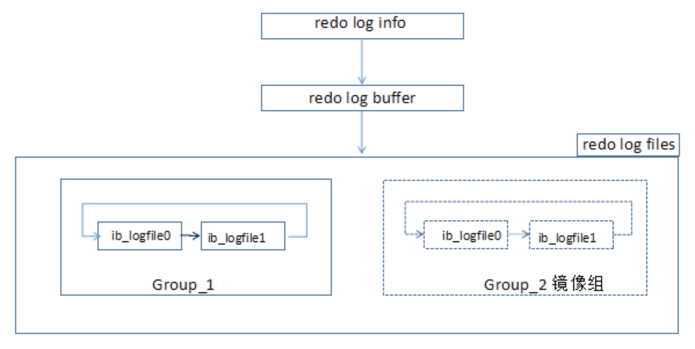

# mysql redo log 重做日志 (InnoDB独有)

## 数据结构

## 流程

重做日志信息-->重做日志缓冲-->重做日志文件-->文件

## redo-log-buffer

- innodb_log_buffer_size buffer大小

## redo-log-file

- innodb_log_file_size 重做日志文件的大小.
- innodb_log_files_in_group 指定重做日志文件组中文件的数量, 默认20
- innodb_mirrored_log_groups 指定了日志镜像文件组的数量, 默认1
- innodb_log_group_home_dir 指定日志文件组所在的路径, 默认./ , 表示在数据库的数据目录下.

## redo-log-buffer刷入redo-log-file的条件

1. Master Thread 每1秒
2. 每个事务commit时
3. 当重做日志缓冲池剩余空间小于1/2时

## redo-log-file刷入磁盘的条件

`innodb_flush_log_at_trx_commit`

- =0 buffer每1秒一次写入redo-log-file, 并且同步flush(刷磁盘); --- 速度快, 丢1s数据.
- =1 每次事务提交写入redo-log-file, fsync同步flush; (default); --- 安全, 速度慢.
- =2 每次事务提交写入redo-log-file, 不同步flush, 但fsync每秒flush; --- 介于中间, 只有断电会丢1s.
