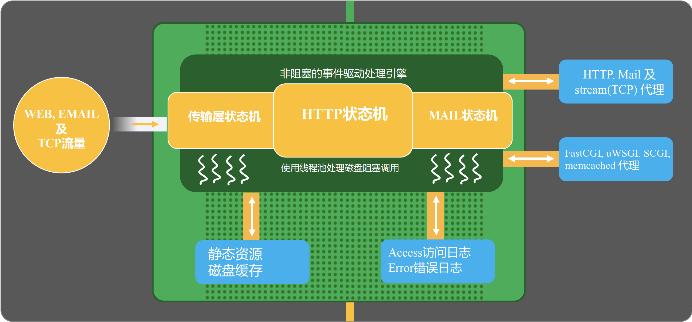
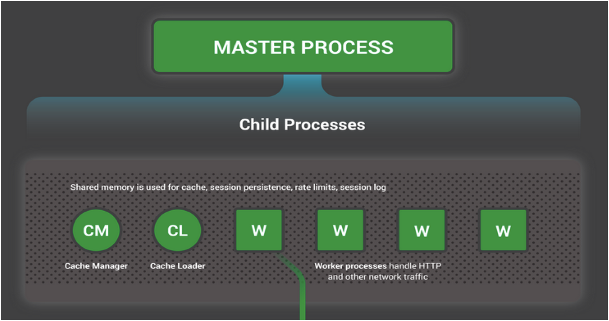
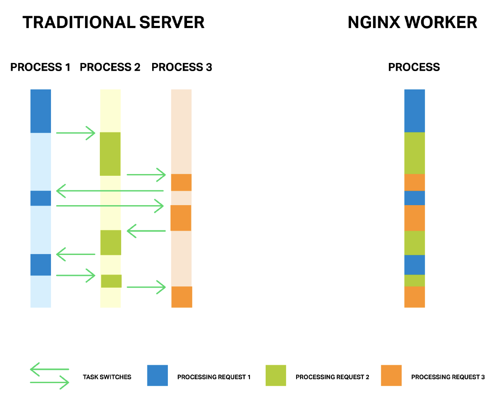

# nginx arch

## 架构

### 主进程 master

    Nginx启动时, 会生成两种类型的进程, 一个是主进程( master ), 一个( windows版本的目前只有一个)或多个工作进程( worker ). 主进程并不处理网络请求, 主要负责调度工作进程 , 也就是图示的3项:  加载配置、启动工作进程及非停升级.所以, Nginx启动以后, 查看操作系统的进程列表, 我们就能看到至少有两个Nginx进程.

### 工作进程 worker

    服务器实际处理网络请求及响应的是工作进程(worker), 在类unix系统上, Nginx可以配置多个worker, 而每个worker进程都可以同时处理数以千计的网络请求.

### 模块化设计

    Nginx的worker进程, 包括核心和功能性模块, 核心模块负责维持一个运行循环(run-loop), 执行网络请求处理的不同阶段的模块功能, 比如: 网络读写、存储读写、内容传输、外出过滤, 以及将请求发往上游服务器等.而其代码的模块化设计, 也使得我们可以根据需要对功能模块进行适当的选择和修改, 编译成具有特定功能的服务器.

### 事件驱动模型

    基于异步及非阻塞的事件驱动模型, 可以说是Nginx得以获得高并发、高性能的关键因素, 同时也得益于对Linux、Solaris及类BSD等操作系统内核中事件通知及I/O性能增强功能的采用, 如kqueue、epoll及event ports.

### 代理(proxy)设计

    代理设计, 可以说是Nginx深入骨髓的设计, 无论是对于HTTP, 还是对于FastCGI、Memcache、Redis等的网络请求或响应, 本质上都采用了代理机制. 所以, Nginx天生就是高性能的代理服务器.

## 进程模型

### master / worker 多进程模型

1. 主程序 Master process 启动后, 通过一个 for 循环来接收和处理外部信号  
2. 主进程通过 fork() 函数产生 worker 子进程 , 每个子进程执行一个 for 循环来实现 Nginx 服务器对事件的接收和处理 .
3. 每个worker一个线程, 避免OS进程间切换损耗(如apache).
4. 用户态完成切换, 将请求异步非阻塞的递交给上游, 并注册事件, 一旦上游返回, 就触发这个事件.

## 交互

### 外界 - master/worker 进程交互

### master - worker 进程交互

### worker - worker 进程交互

### worker - master 进程交互

### oldmaster - newmaster 进程交互

## 实战

- 推荐worker`进程数与CPU内核数一致`.避免了进程之间竞争CPU资源和进程切换的开销

- nginx提供了`CPU亲缘性的绑定选项`, 一个进程绑定在某一个核上, 这样就不会因为进程的切换带来Cache的失效, 提高CPU缓存命中率.  
