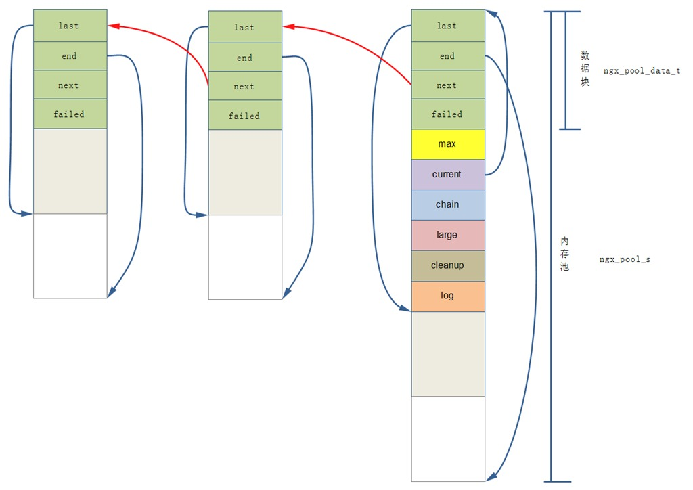

# nginx 池

## 内存池



### 源码

src/core/ngx_palloc

### 数据结构

```c
# 内存池数据块结构
typedef struct {
    u_char               *last; # 是一个unsigned char 类型的指针, 保存的是/当前内存池分配到末位地址, 即下一次分配从此处开始.
    u_char               *end; # 内存池结束位置；
    ngx_pool_t           *next; # 内存池里面有很多块内存, 这些内存块就是通过该指针连成链表的, next指向下一块内存.
    ngx_uint_t            failed; # 内存池分配失败次数.
} ngx_pool_data_t;

# 内存池头部结构
struct ngx_pool_s {
    ngx_pool_data_t       d; # 内存池的数据块；
    size_t                max; # 内存池数据块的最大值；
    ngx_pool_t           *current; # 指向当前内存池；
    ngx_chain_t          *chain; # 该指针挂接一个ngx_chain_t结构；
    ngx_pool_large_t     *large; # 大块内存链表, 即分配空间超过max的情况使用；
    ngx_pool_cleanup_t   *cleanup; # 释放内存池的callback
    ngx_log_t            *log; # log
};
```

### 方法

创建内存池 ngx_pool_t \*  ngx_create_pool(size_t size, ngx_log_t *log);  
销毁内存池 void ngx_destroy_pool(ngx_pool_t *pool);  
重置内存池 void ngx_reset_pool(ngx_pool_t *pool);  
内存申请(对齐) void \*  ngx_palloc(ngx_pool_t *pool, size_t size);  
内存申请(不对齐) void \*  ngx_pnalloc(ngx_pool_t *pool, size_t size);  
内存清除 ngx_int_t  ngx_pfree(ngx_pool_t *pool, void *p);  

## 实战

### 连接内存池

模块：ngx_http_core_module
指令：connection_pool_size 连接预分配内存

### 请求内存池

模块：ngx_http_core_module
指令：request_pool_size 请求预分配内存

## ref

[nginx源码学习----内存池](https://www.cnblogs.com/xiekeli/archive/2012/10/17/2727432.html)
