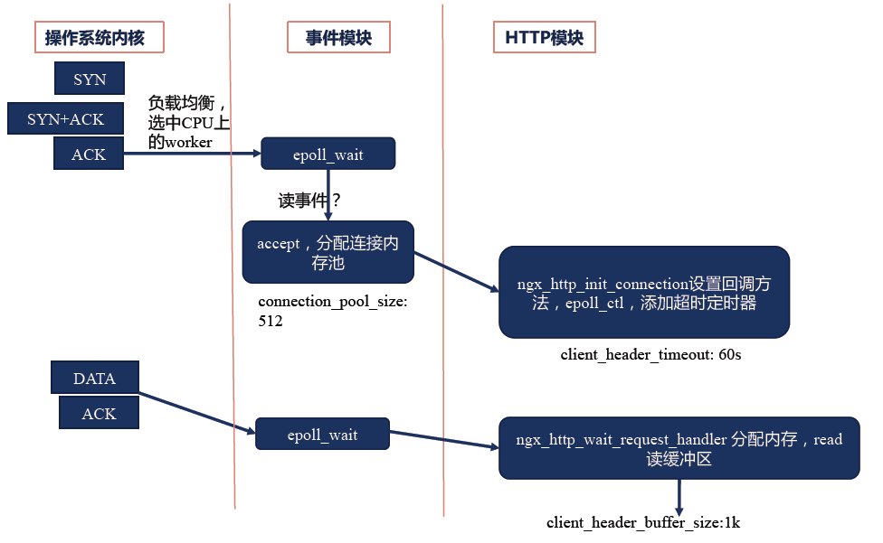
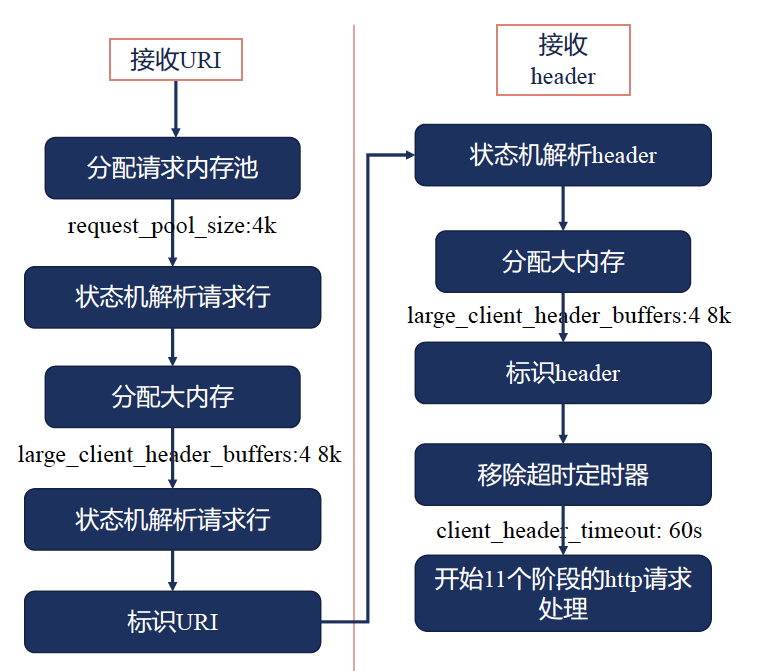
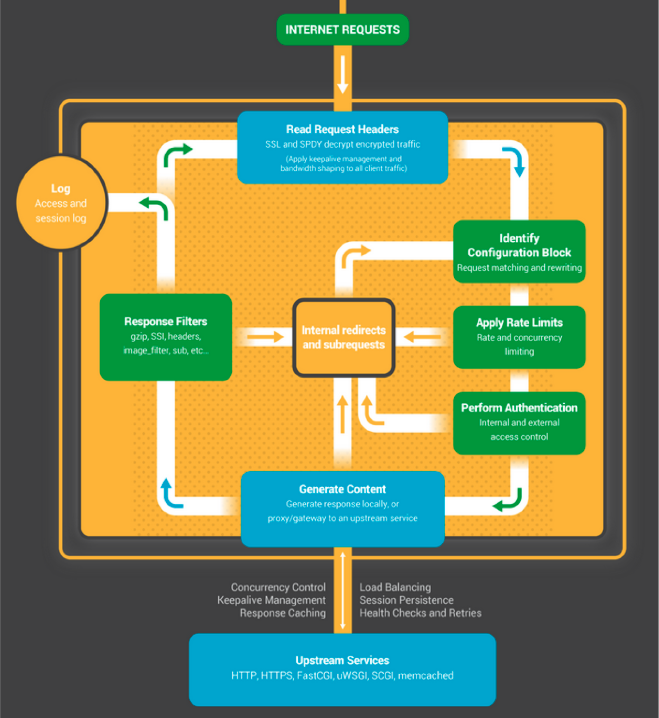
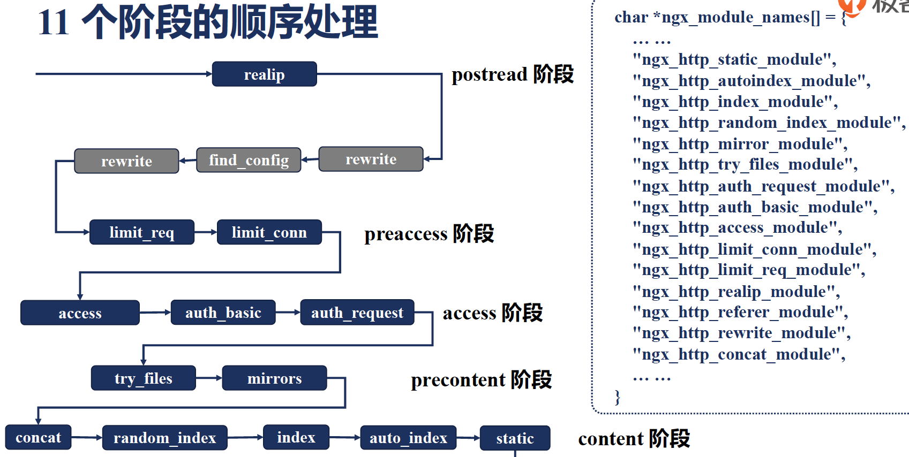

# nginx处理流程

## 惊群

同一个时刻只能有唯一一个worker子进程监听web端口，此时新连接事件只能唤醒唯一正在监听端口的worker子进程。采用锁，互斥量实现。  
`https://blog.csdn.net/lyztyycode/article/details/78648798`

## 互斥锁

实现1: 原子操作 + 信号量  
实现2: 文件锁封装

## 锁占用时间过长

## 处理请求header的流程

## 处理请求流程

1. nginx在启动时，会解析配置文件，得到需要监听的端口与ip地址，然后在nginx的master进程里面  
2. 初始化好这个监控的socket，再进行listen  
3. fork出多个子进程(worker)出来,  worker会竞争accept_mutex新的连接  
4. 客户端与nginx(worker)进行三次握手建立连接  
5. 当某一个worker accept成功，会创建nginx对连接的封装，即ngx_connection_t结构体  
6. 根据事件调用相应的事件处理模块，如http模块与客户端进行数据的交换  
7. nginx或客户端来主动关掉连接。(一般客户端主动， 超时的话nginx主动)  

| 序号 | 阶段           | 指令                             | 备注                                                                                                                                             |
| ---  | ---            | ---                              | ---                                                                                                                                              |
| 1    | POST_READ      | realip                           | 接收完请求头之后的第一个阶段，它位于uri重写之前，实际上很少有模块会注册在该阶段，默认的情况下，该阶段被跳过                                      |
| 2    | SERVER_REWRITE | rewrite                          | server级别的uri重写阶段，也就是该阶段执行处于server块内，location块外的重写指令，在读取请求头的过程中nginx会根据host及端口找到对应的虚拟主机配置 |
| 3    | FIND_CONFIG    |                                  | 寻找location配置阶段，该阶段使用重写之后的uri来查找对应的location，值得注意的是该阶段可能会被执行多次，因为也可能有location级别的重写指令        |
| 4    | REWRITE        | rewrite                          | location级别的uri重写阶段，该阶段执行location基本的重写指令，也可能会被执行多次                                                                  |
| 5    | POST_REWRITE   |                                  | location级别重写的后一阶段，用来检查上阶段是否有uri重写，并根据结果跳转到合适的阶段                                                              |
| 6    | PRE_ACCESS     | limit_req, limit_conn            | 访问权限控制的前一阶段，该阶段在权限控制阶段之前，一般也用于访问控制，比如限制访问频率，链接数等                                                 |
| 7    | ACCESS         | auth_basic, access, auth_request | 访问权限控制阶段，比如基于ip黑白名单的权限控制，基于用户名密码的权限控制等                                                                       |
| 8    | POST_ACCESS    |                                  | 问权限控制的后一阶段，该阶段根据权限控制阶段的执行结果进行相应处理                                                                               |
| 9    | PRE_CONTENT    | try_files, mirrors               | try_files指令的处理阶段，如果没有配置try_files指令，则该阶段被跳过                                                                               |
| 10   | CONTENT        | concat, index, autoindex, static | 内容生成阶段，该阶段产生响应，并发送到客户端                                                                                                     |
| 11   | LOG            | access_log                       | 日志记录阶段，该阶段记录访问日志                                                                                                                 |

## 相同阶段模块执行顺序

1. 同阶段中模块执行顺序与 `ngx_module_names[] = {}`数组的顺序相反。
2. 某些模块执行成功，可能直接跳到下一阶段。

## [实战](nginx-modules.md)
