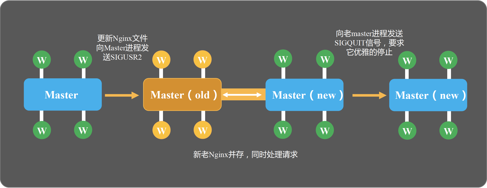

# nginx信号

> 以下信号量省略SIG前缀。如 SIGQUIT 即 QUIT

## master
`TERM`、`INT` 立刻关闭。同`nginx -s stop`  
`QUIT` 从容关闭，等待worker处理结束后关闭。同`nginx -s quit`  
`HUP` 平滑重启，重新加载配置文件。同`nginx -s reload`  
`USR1` 重新打开日志文件。同`nginx -s repoen`  
`USR2` 平滑升级可执行程序。(热部署用到)   
`WINCH` 从容关闭worker，保留master。(热部署用到)  

## worker
`TERM`  
`QUIT`  
`USR1`  

## 内部调用信号
`CHID` 当独立关闭worker(`kill -TERM < worker >`)时，worker向master发送`SIGCHID`信号，worker进入Zombie状态，master收到信号后处理该worker。  
`ALRM` 每个worker为避免长时间阻塞OS调用，通过alarm系统调用和`SIGALRM`信号实现秒级定时器。

## 交互
### 外界 - master/worker 进程交互
### master - worker 进程交互
### worker - worker 进程交互
### worker - master 进程交互
### oldmaster - newmaster 进程交互

## 实战
## HUP / reload

1. 向master发送`HUP`
2. master校验配置语法。同`nginx -t`
3. (若配置需要)master打开新端口
4. master用新配置启动新worker
5. master向老worker发送`QUIT`

### QUIT / quit 优雅关闭
1. 向master发送`QUIT`
2. 设置定时器 `worker_shutdown_timeout`
3. 关闭监听句柄 (不处理新链接)
4. 关闭空闲链接 (释放连接池中空闲链接)
5. 在循环中等待全部链接关闭
6. 退出进程

### 热部署

1. 移出老nginx二进制，移入新nginx二进制文件。(注意备份)
2. 平滑升级: `kill -USR2 < old master >` 新老master,work都在运行，老nginx不处理新请求，并不再监听80端口。
3. master修改pid文件。`mv pid pid.oldbin`(以下操作老master，都用到这个pid.oldbin)
3. 优雅关闭老worker: `kill -WINCH < old master >`但保留老master，以备版本回退。
   1. 回退1: `kill -HUP < old master >`重启老master，老master会向新master发送`QUIT`。
   2. 回退2: `kill -TERM < new master >`关闭新master，老master会自动`HUP`
4. 关闭老master: `kill -QUIT < old master >`

### 日志切割
1. mv < log > < bak log >
2. kill -USR1 < nginx master pid >
3. 以上可放入crontab