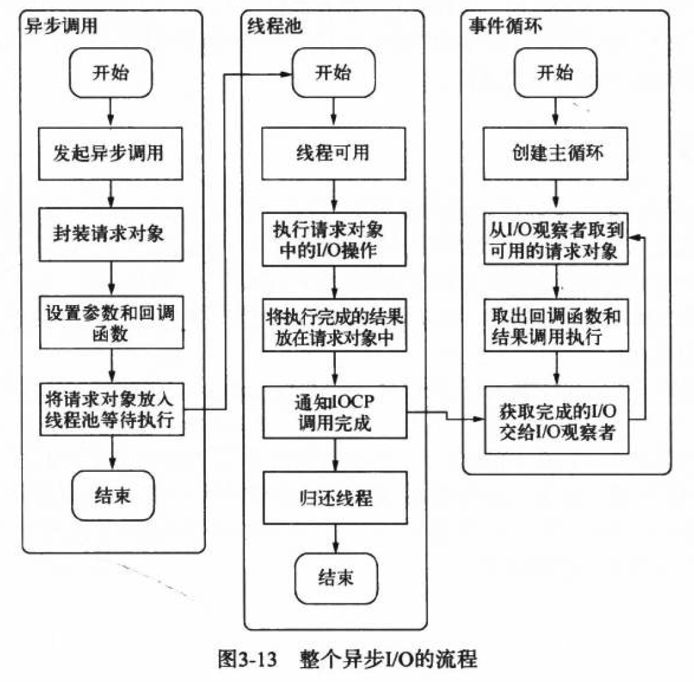

# nodejs

## 特点
异步io  
事件驱动与回调  
单线程时间轮询  
跨平台  
- libuv: 抽象封装兼容linux， windows。
- linux libeio+libev: 采用线程池与阻塞io模拟异步io
- windows IOCP: 线程池完全异步 

## 缺点
异常处理  
- 回调函数会在下一个事件循环中(Tick)才会被取出执行，而try/catch只能捕获当前当前事件循环中的异常。  
- 约定一般异常作为回调函数的第一个实参传回`async(function(err, result){  })`  

嵌套太深  

阻塞代码  
- 单线程导致sleep会阻塞所有任务  

多线程编程  

异步转同步  

## 模块

## 异步io
事件循环  
观察者  
请求对象  
执行回调  

  

## 异步编程
### 方式
[ 回调地狱 ](src/nodejs/callbackhell.js)  
[ Promise ](src/nodejs/promise.js)  
[ Generator ](src/nodejs/generator.js)  
[ async/await ](src/nodejs/async.js)  

### 异步并发控制
原因
- 异步调用需占用fd，并发量过大时需要限制异步操作数量

思路
- 队列

实践
- `async.parallelLimit()`

## 异常
https://segmentfault.com/a/1190000009651765

## 内存控制 GC

## 网络编程

## 多进程

## 测试

## 编程规范

## framework
pomelo

## website
| name | weibsite |
| --- | --- |
| nodejs中文官网 | http://nodejs.cn |

## book
深入浅出nodejs