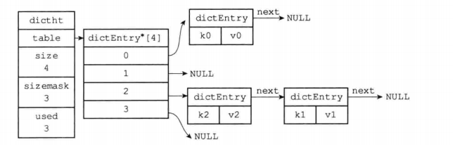

# redis 编码 hashtable

OBJ_ENCODING_HT

## 作用于

OBJ_HASH  
OBJ_SET

## source code

src/dict

## 数据结构



```c
// 字典
struct dict{
    dictType *type;             // 类型特定函数 即dictType
    void *privdata;             // 私有数据 用于dictType中函数的可选参数
    dictht ht[2];               // 哈希表x2 用于rehash
    long rehashidx;             // rehash索引，不rehash时=-1, 开始rehash时=0
    unsigned long iterators;    // 当前字典迭代次数
}

// 哈希表
struct dictht{
    dictEntry **table;      // 哈希表数组 bucket
    unsigned long size;     // 哈希表大小 bucket的个数 默认4个
    unsigned long sizemask; // 哈希表大小掩码，用于计算索引值。总等于size-1
    unsigned long used;     // 哈希表已使用节点(dictEntry)的数量
}

// 哈希表节点
struct dictEntry{
    void *key;              // 键
    union {                 // 值
        void *val;
        uint64_t u64;
        int64_t s64;
        double d;
    } v;
    struct dictEntry *next; // 指向一下个dictEntry形成链表
}

// 字典类型函数
struct dictType{
    uint64_t (*hashFunction)(const void *key);                              // 计算hash值
    void *(*keyDup)(void *privdata, const void *key);                       // 复制键
    void *(*valDup)(void *privdata, const void *obj);                       // 复制值
    int (*keyCompare)(void *privdata, const void *key1, const void *key2);  // 比较键
    void (*keyDestructor)(void *privdata, void *key);                       // 销毁键
    void (*valDestructor)(void *privdata, void *obj);                       // 销毁值
}

```

## 哈希算法

```js
hash = dict->type->hashFunction(key);  // 使用字典的哈希函数，计算key的哈希值
index = hash & dict->ht[?].sizemask;  // 使用哈希表的sizemask属性和哈希值，计算出插入哈希表节点的索引值
```

## 键冲突

Q: 当2+个键被分配到哈希表数组的同一个索引，即键冲突 collision  

A: 通过链地址法(separate chaining)解决，新节点添加到链表表头位置。

## rehash

Q: 哈希表键值对太多或太少  

A: 进行rehash操作来扩容或缩容(改变哈希表数组的大小)

### 渐进式rehash

条件: CURD时 || 定时器

> dict->rehashindex 记录了迁移的索引进度
>
> rehash过程中CURD操作会先在ht[0]进行，没有的话再到ht[1]操作。

### 扩容缩容

扩容条件: used > size || fork进行cow时 used * 5 > size

```c
d->ht[0].used >= d->ht[0].size && (dict_can_resize || d->ht[0].used/d->ht[0].size > dict_force_resize_ratio)
```

缩容条件: used * 10 < size && size > 4 && fork进行cow时不缩容

```c
(size > DICT_HT_INITIAL_SIZE && (used*100/size < HASHTABLE_MIN_FILL))
```

> `扩容/缩容的size` dict->ht[1].size = dict->ht[0].used * 2
>
> `load factor` = ht[0].used / ht[0].size 负载因子
>
> `dict_can_resize` 是否rehash fork进程进行copy on write（如rdb, aof, module）时值为0
>
> `dict_force_resize_ratio` = 5 即子进程存在期间(bgsave, bgrewriteof)所需负载因子较大，尽量避免扩容带来的内存消耗。  


## API

| 函数名称         | 作用                               | 复杂度 |
| ---------------- | ---------------------------------- | ------ |
| dictCreate       | 创建字典                           | O(1)   |
| dictAdd          | 将给定键值添加到字典               | O(1)   |
| dictReplace      | 将给定键值添加到字典，若存在则替换 | O(1)   |
| dictFetchValue   | 返回指定键的值                     | O(1)   |
| dictGetRandomKey | 随机返回一个键值对                 | O(1)   |
| dictDelete       | 字典中删除给定键所对应键值对       | O(1)   |
| dectRelease      | 释放给定字典，及字典中所有键值对   | O(N)   |

## issues

如何保证field互斥的？  
random为啥O(1)？
