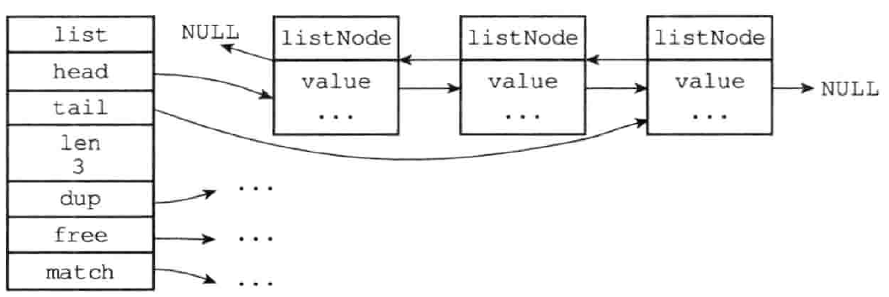

# redis 编码 linkedlist 双端链表

OBJ_ENCODING_LINKEDLIST

## 作用于

OBJ_LIST

## souce code

src/adlist

## 数据结构



```c
// 链表
typedef struct list {
    listNode *head; // 头节点
    listNode *tail; // 尾节点
    unsigned long len; // 节点数量
    void *(*dup)(void *ptr); // 节点值复制函数
    void (*free)(void *ptr); // 节点释放函数
    int (*match)(void *ptr, void *key); // 节点值对比函数
} list;

// 节点
typedef struct listNode {
    struct listNode * prev; // 前置节点
    struct listNode * next; // 后置节点
    void *value; // 节点数据
} listNode;
```

## 特性

1. 双端 获取前置，后置节点O(1)  
2. 无环 对链表访问以null结尾  
3. 首尾 获取head tail节点O(1)  
4. 长度 获取长度O(1)  
5. 多态 void*类型保存任意类型节点值  

## API

| 函数名称           | 作用                                   | 复杂度                                         |
| ------------------ | -------------------------------------- | ---------------------------------------------- |
| listSetDupMethod   | 将给定的函数设置为链表的节点值复制函数 | 复制函数可以通过链表的dup 属性直接获得，O(1)   |
| listGetDupMethod   | 返回链表当前正在使用的节点值复制函数   | O(1)                                           |
| listSetFreeMethod  | 将给定的函数设置为链表的节点值释放函数 | 释放函数可以通过链表的free 属性直接获得，O(1)  |
| listGetFree        | 返回链表当前正在使用的节点值释放函数   | O(1)                                           |
| listSetMatchMethod | 将给定的函数设置为链表的节点值对比函数 | 对比函数可以通过链表的match 属性直接获得，O(1) |
| listGetMatchMethod | 返回链表当前正在使用的节点值对比函数   | O(1)                                           |
| listLength         | 返回链表的长度（包含了多少个节点）     | 链表长度可以通过链表的len 属性直接获得，O(1)   |
| listFirst          | 返回链表的表头节点                     | 表头节点可以通过链表的head 属性直接获得，O(1)  |
| listLast           | 返回链表的表尾节点                     | 表尾节点可以通过链表的tail 属性直接获得，O(1)  |
| listPrevNode       | 返回给定节点的前置节点                 | 前置节点可以通过节点的prev 属性直接获得，O(1)  |
| listNextNode       | 返回给定节点的后置节点                 | 后置节点可以通过节点的next 属性直接获得，O(1)  |
| listNodeValue      | 返回给定节点目前正在保存的值           | 节点值可以通过节点的value属性直接获得，O(1)    |
| listCreate         | 创建一个不包含任何节点的新链表         | O(1)                                           |
| listAddNodeHead    | 将新节点添加到给定链表的表头           | O(1)                                           |
| listAddNodeTail    | 将新节点添加到给定链表的表尾           | O(1)                                           |
| listInsertNode     | 将新节点添加到给定节点的之前或者之后   | O(1)                                           |
| listSearchKey      | 查找并返回链表中包含给定值的节点       | O(N)，N 为链表长度                             |
| listIndex          | 返回链表在给定索引上的节点             | O(N)，N 为链表长度                             |
| listDelNode        | 从链表中删除给定节点                   | O(N)，N 为链表长度                             |
| listRotate         | 将链表的表尾节点弹出插入到链表的表头   | O(1)                                           |
| listDup            | 复制一个给定链表的副本                 | O(N)，N 为链表长度                             |
| istRelease         | 释放给定链表，以及链表中的所有节点     | O(N)，N 为链表长度                             |

## usage

lpush + lpop = Stack（栈）
lpush + rpop = Queue（队列）
lpsh + ltrim = Capped Collection（有限集合）
lpush + brpop = Message Queue（消息队列）
