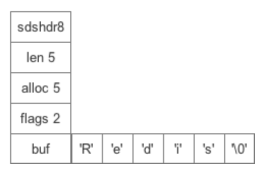

# redis 编码 sds

OBJ_ENCODING_EMBSTR  
OBJ_ENCODING_RAW  

## 作用于

string

## source code

src/sds

## 数据结构



```c
struct sds {
    uint?_t len; # 字符串长度，不包含终止字符空（\0）
    uint?_t alloc; # 字符串最大容量，不包含header和终止字符空
    unsigned char flags; # header的5种类型 --- 0~4 对应 SDS_TYPE_5/8/16/32/64
    char buf[]; # 字节数组
}
```

实例

```c
    s1 = [
        0x05, // len = 5
        0x80, // alloc = 8
        0x01, // flag = 1 --- 即header为sdshdr8类型
        "r", // SDS的本质char*（字符串指针）指向该位s1[0]，若想获取flag则s1[-1]
        "e",
        "d",
        "i",
        "s",
        "\0", // 填充 该位s1[len] = s1[5]
        "",
        "",
    ];
```

## 特性

1. 预分配 --- 小于1M 翻倍扩容； 大于1M 每次多扩容1M
2. 惰性删除 --- 字符串缩减后空间不释放
3. 不以\0作为终止，故可存储任意二进制数据
4. len直接获得长度

## API

| 函数名称       | 作用                                                            | 复杂度 |
| -------------- | --------------------------------------------------------------- | ------ |
| sdsempty       | 创建一个只包含空字符串””的sds                                   | O(N)   |
| sdsnew         | 根据给定的C字符串，创建一个相应的sds                            | O(N)   |
| sdsnewlen      | 创建一个指定长度的sds，接受一个指定的C字符串作为初始化值        | O(N)   |
| sdsdup         | 复制给定的sds                                                   | O(N)   |
| sdsfree        | 释放给定的sds                                                   | O(1)   |
| sdsupdatelen   | 更新给定sds所对应的sdshdr的free与len值                          | O(1)   |
| sdsMakeRoomFor | 对给定sds对应sdshdr的buf进行扩展                                | O(N)   |
| sdscatlen      | 将一个C字符串追加到给定的sds对应sdshdr的buf                     | O(N)   |
| sdscpylen      | 将一个C字符串复制到sds中，需要依据sds的总长度来判断是否需要扩展 | O(N)   |
| sdscatprintf   | 通过格式化输出形式，来追加到给定的sds                           | O(N)   |
| sdstrim        | 对给定sds，删除前端/后端在给定的C字符串中的字符                 | O(N)   |
| sdsrange       | 截取给定sds，[start,end]字符串                                  | O(N)   |
| sdscmp         | 比较两个sds的大小                                               | O(N)   |
| sdssplitlen    | 对给定的字符串s按照给定的sep分隔字符串来进行切割                | O(N)   |

## ref

[Redis深入浅出——字符串和SDS](https://blog.csdn.net/qq193423571/article/details/81637075)  
