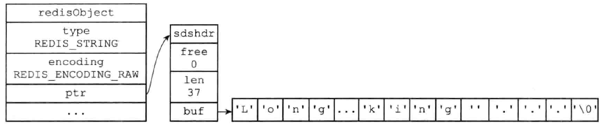

# redis 字符串对象

## encoding

OBJ_ENCODING_INT  
OBJ_ENCODING_EMBSTR  
OBJ_ENCODING_RAW  

### 实例



```c
// int
redisObject {
    type: REDIS_STRING,
    encoding: REDIS_ENCODING_INT,
    ...
    ptr:  12345
}
//embstr 略
// raw
redisObject {
    type: REDIS_STRING,
    encoding: REDIS_ENCODING_RAW,
    ...
    ptr: &sdshdr{
        len: 5,
        malloc: 5,
        flag: 1,
        buf: [h,e,l,l,o,\0],
    }
}
```

### 转换

int, embstr, raw  

| encoding | 条件               | malloc次数 | 释放次数 | RedisObject与SDS连续存放(有利缓存) |
| -------- | ------------------ | ---------- | -------- | ---------------------------------- |
| int      | len <=19 && 纯数字 | 1          | 1        | 是                                 |
| embstr   | len <= 44          | 1          | 1        | 是                                 |
| raw      | len > 44           | 2          | 2        | 否                                 |

> 字符长度区分在44 = 64 - 19 - 1  
> 64: 总体占用超过64byte，redis认为是大字符串  
> 19: SDS对象header为alloc+3; 即最小字符串占用16+3=19  
> 1: \0

```js
set foo 123 // int
append foo over // raw (123over)

set foo abc // int
append foo d// raw (abcd)

set foo 123 // int
incr foo // int (124)
```

- embstr是只读的（无修改的方法）当对**embstr进行append**时，会先变为raw再修改。
- 当对**int进行append**时，也会变为raw再修改。
- 当对**int进行incr**等操作，是对int的修改，不会转化类型。

<!-- ## 实现

| cmd         | int           | embstr               | raw                  |
| ----------- | ------------- | -------------------- | -------------------- |
| set         | int           | embstr               | raw                  |
| get         | copy ->string |
| append      | ->raw         | ->raw                | sdscatlen()          |
| incrbyfloat | ->long double | ->long double or err | ->long double or err |
| incrby      | +             | err                  | err                  |
| decrby      | -             | err                  | err                  |
| strlen      | copy ->string | sdslen()             | sdslen()             | --> |
