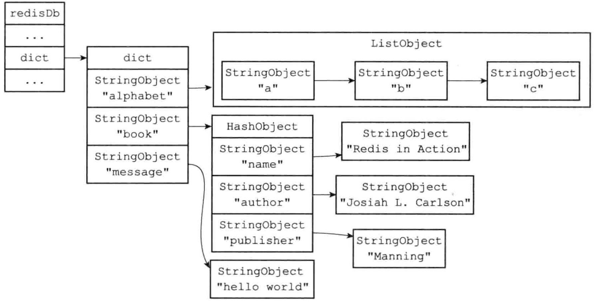

# reids对象

## 数据结构



```c
// redis db对象
typedef struct redisDb {
    dict *dict;                 /* The keyspace for this DB */
    dict *expires;              /* Timeout of keys with a timeout set */
    dict *blocking_keys;        /* Keys with clients waiting for data (BLPOP)*/
    dict *ready_keys;           /* Blocked keys that received a PUSH */
    dict *watched_keys;         /* WATCHED keys for MULTI/EXEC CAS */
    int id;                     /* Database ID */
    long long avg_ttl;          /* Average TTL, just for stats */
    list *defrag_later;         /* List of key names to attempt to defrag one by one, gradually. */
} redisDb;

// redis值对象
typedef struct redisObject {
    unsigned type:4; // 类型 REDIS_STRING、REDIS_LIST、REDIS_SET、REDIS_ZSET、REDIS_HASH
    unsigned encoding:4; // 编码 OBJ_ENCODING_xx(RAW、INT、HT、ZIPLIST、INTSET、SKIPLIST、EMBSTR、QUICKLIST、STREAM)
    unsigned lru:LRU_BITS; // 24bit
    int refcount; // 引用计数
    void *ptr; // 指向底[层数据结构](redis-encoding.md)的指针
} robj;
```

## obj与encoding关系

`ssize_t rdbSaveObjectType(rio *rdb, robj *o, robj *key)` # src/rdb.c

| redisObj | 短结构      | 长结构                |
| -------- | ----------- | --------------------- |
| string   | int、embstr | raw                   |
| list     | ziplist     | linkedlist、quicklist |
| hash     | ziplist     | hashtable             |
| set      | intset      | hashtable             |
| zset     | ziplist     | skiplist              |

## [string对象](redis-obj-string.md)

## [list对象](redis-obj-list.md)

## [hash对象](redis-obj-hash.md)

## [set对象](redis-obj-set.md)

## [zset对象](redis-obj-zset.md)

## [LRU](redis-cache-eliminate.md)

## refcount

### 对象回收

```c
void incrRefCount(robj *o); // 对象的引用计数+1
void decrRefCount(robj *o); // 对象的引用计数-1
robj resetRefCount(robj *o); // 对象的引用计数清零(但不释放对象)
```

### 对象共享

server初始化时会创建一些共享对象，供自定义的值对象共享。

```c
void createSharedObjects(void); // server初始化时创建共享对象
// 整数类: 0 1 2 ... 9999
// 字符类: \r\n; +PONG\r\n; +OK\r\n
// 报错类: -ERR no such key\r\n
// 命令类: DEL; RPOP
// 特别标记类: minstring maxstring
```

> 若某key得值对象是共享对象，则`object refcount <key>`返回2147483647(INT_MAX)。
