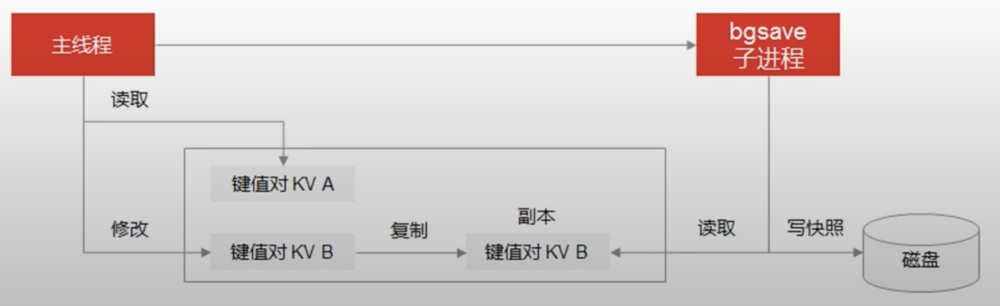

# RDB  

@@redis @@COW

    生成紧凑的快照文件来持久化当前的数据

## 优点

- 数据紧凑  
- 备份灵活  
- 恢复快捷  

## 缺点

- 间隔较长, 不够耐久耐用(durable)
- fork耗时

## 生成流程 COW

1. fork子进程, 子进程将内存中的数据序列化到临时rdb
2. 生成RDB过程中若接收到的新写入指令, 主进程正常写入 并 copy一份涉及写入的内存页, 产生一个副本x
3. 生成RDB完成后 将x应用到临时rdb, 临时rdb替换旧的rdb.

> `COW` copy-on-write写时复制; write时copy出副本进行写入, 写完覆盖.

## 使用流程

    文件载入到内存

## [集群同步](redis-replication.md)

## config  

- `save 900 1` 在900秒(15分钟)之后, 如果至少有1个key发生变化, 则dump内存快照.  
- `save 300 10` 在300秒(5分钟)之后, 如果至少有10个key发生变化, 则dump内存快照.  
- `save 60 10000` 在60秒(1分钟)之后, 如果至少有10000个key发生变化, 则dump内存快照.  

### ref

[redis系列--主从复制以及redis复制演进](https://www.cnblogs.com/wdliu/p/9407179.html)
