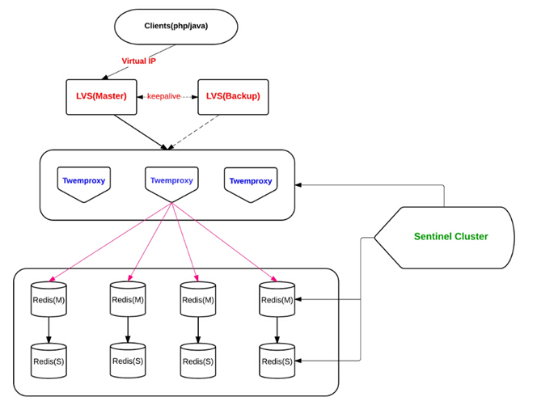

# redis - twemproxy

## 模式

    代理

## 优点  

    开发简单, 对应用几乎透明
    历史悠久, 方案成熟
    轻量快速可报警  
    支持redis, memcache; 支持pipelinling;
    支持多个哈希算法包括DHT
    支持自动分区, 如果其代理的某节点不可用, 自动排除该节点(这将改变keys-instance映射关系, 所以只能用于充当缓存的场景).  
    非单点  
    hash_tag

## 缺点  

    代理影响性能
    lvs和twemproxy会有节点性能瓶颈
    redis扩容非常麻烦
    twitter内部已放弃使用该方案, 新使用的架构未开源
