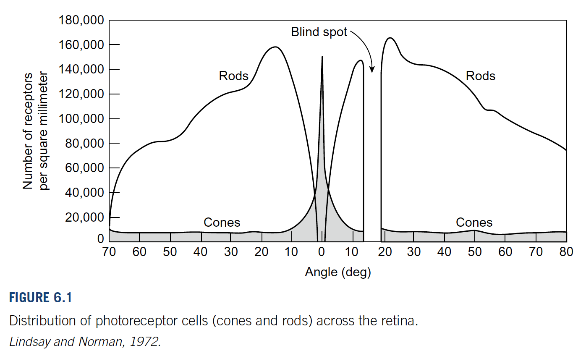

# designing

## USER perceptions are biased by

- `the past` our experience
- `the future` our goals

---

## DESIGNING perceptions

### avoid ambiguity

Avoid ambiguity information display , and test your design to verify that all users interpret the display in the same way .

### be consistent

Place information and control in consistent locations.

### understand the goals

User come to a system with goalsthey want to achieve.

---

## GESTALT principle

### Proximity

Relative distance between objects in a display affects our perception of whether and how the objects are organized into sub groups .

- menu

### Similarity

Objects that look similar appear grouped , all other things being equal .

- icon
- form

### Continuity

States that our visual perception is biased to perceive continuous forms rather than disconnected segments .

- half the picture, half the text.

### Closure

State that our visual system automatically tries to close open figures so that they are perceived as whole objects rather than separate pieces .

- icon

### Symmetry

Our vision automatically organizes and interprets the data so as to simplify it and give it symmetry .

- parses very complex two dimensional images info three dimensional scenes .

### Figure / Ground

The foreground consists of those elements of a scene that are the object of our primary attention , and the background is everything else .

- pop up
- icon

### Common Fate

Move together are perceived as grouped or related .

- when users drag folders that they have selected , common highlight and motion make the selected folders appear grouped .

### Structure

The more structured and terse the presentation of information, the more quickly and easily people can scan and comprehend it .

- indent content
- terser repetitious
- improved by table
- separate long numbers .

---

## Reading Unnatural (disrupt)

### Uncommon or unfamiliar vocabulary

### Difficult scripts and typefaces

- Tiny fonts
- Text on noisy background

### Information buried in repetition

- Centered text
- Reverse Color, Combining flaws that disrupt reading

### Too much text in a user interface

---

## Color Vision

### How color vision work

#### Trichromacy 三色视觉

posits three types of cones preferentially sensitive to blue, green, and red.
视网膜的三种视锥细胞分别优先敏感于蓝、绿和红色.

#### Opponent process 互补处理

It states that the visual system interprets color in an antagonistic way: red vs. green, blue vs. yellow, black vs. white.
视觉系统以一种拮抗的方式解释颜色：红对绿, 蓝对黄, 黑对白.

### Vision is optimize for contrast, not brightness

The sensitive of our visual system to contrast rather than to absolutely brightness.

### Discriminate colors depends on how colors are presented

- `paleness`

    The paler(less saturated) two color are, the harder it is to tell them apart. such as pale color marking.

- `color patch size`

    The smaller and thinner objects are, the harder it is to distinguish their color. such as chart legend.

- `separation`

    The more separated color patches are, the more difficult it is to distinguish. such as unfollowed link from already followed ones.

### Color blindness

- red/green color-blindness people can't distinguish; male 9%, female 1%.
  - dark red from black
  - blue from purple
  - light green from white

### External factors that influence the ability to distinguish colors

- variation among color displays
  - computer display vary
- gray-scale display
- display angle
- ambient illusion
  - strong light on a display washes out color

### Guidelines for using color

1. use distinctive colors
2. avoid color pairs that color-blindness cannot distinguish
3. use color redundantly with other cue
   - use symbol icon
4. avoid separate opponent colors

---

## Peripheral Vision is Poor

### Resolution of the fovea compared to that of the periphery

- The fact that retinal cone cells are distributed tightly in and near the fovea, and sparsely in the peripheral of the Retina affects not only spatial resolution but color resolution as well.
- our visual field has a gap, which we see nothing, called blind spot. we brain fills it with the surrounding.

### Example from computer user interfaces

- after the click, an error message appear in the periphery

#### solve methods

- put it where users are looking
- Mark the error
- use an error symbol
- reserve red for errors

#### avoid heavy artillery for making user notice

- Pop-up message in error dialog box
- Use sound (e.g. beep)
- Flash or wiggle briefly

## Attention is limited, memory is imperfect

### characteristic of long-term memory

- eror prone
- weighted by emotions
- retroactively alterable

#### implication of long-term memory characteristic for user interface design

- password prompt hint
- user-interface consistency, the more consistency, the less to learn

### characteristic of short-term memory

- attention is highly and selectively
- the capacity of working memory is low
- the volatility of working memory is high

#### implication of short-term memory characteristic for user interface design

- search box retains search keyword
- they forget what mode the system is in and do the wrong thing by mistake

---

