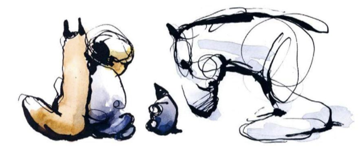

# 男孩、鼹鼠、狐狸和马

    一人, 一鼠, 一狐, 一马
    在旅途中偶然相遇, ta们各自独立, 有着不同的性格, 但可以互相支撑和促进, 这是一个关于友谊与爱的故事.

> 读过最短的书, 十几分钟读完了, 甚至没来得及加入到todo-list! 就干下这碗鸡汤

> 英文版手写字体难适应, 要多习惯一会儿

## 鼹鼠

        男孩和鼹鼠不期而遇, 他们本是世上最弱小的存在,
        但爱让他们结伴同行, 相互支撑和陪伴
        坦诚的面对未知世界 并且 持续的探讨人生
        ta偏爱蛋糕, 那是生活中的小确幸, 苦难后的一丝甘甜

        鼹鼠: "我可真小啊"
        男孩: "的确, 但你让一切有了很大不同"

        我是多么幸运, 遇到了你, 世界因你而不同.

        鼹鼠象征着爱和友谊, 同时有点像初生牛犊不怕虎的少年

## 狐狸

        "要不是落入了这个陷阱, 我就会杀了你", 狐狸本性凶残狡诈, 对鼹鼠贴脸恐吓道
        而当ta落入了猎人的陷阱, "鼹鼠用小小的牙齿一点一点地咬断了铁链".
        目露凶光的狐狸因鼹鼠的相救而渐渐放下了戒备,

        当鼹鼠不慎落水, 狐狸奋不顾身的跳入水中营救, 
        冰冷的湖面没过狐狸的全身, ta的眼中坚定如铁

        当马问到"我需要一个继续走下去的理由"时,
        冷漠的狐狸竟然脱口而出: "因为你们三个"

        狐狸: "坦诚说, 我常常觉得自己没什么有趣的事情可以分享"
        马: "坦诚就是一件有趣的事儿啦"
        多数时候, ta是默默陪伴的守护者, 缄默而坦诚

        狐狸象征着戒备与隔阂, 同时有点像被社会暴击过的成年人, 终被友情救赎

## 马

        "我会飞, 但因为其他马嫉妒我, 我就不飞了" 
        一句话概括了马的生存背景, 也注定了孤单不自信的性格, ta在意别人的目光
        所以也只有马会问出: "我需要一个继续走下去的理由"

        还好ta遇到了善良的小男孩和爱ta的伙伴们, 
        "我们爱你, 不论你会不会飞"
        宝马良驹被爱与善良孵化, 成了行空的天马

        马象征着内敛沉稳, 同时有点像历经沧桑拥有睿智的的老人

## 男孩

        男孩觉得自己不强大, 不完美, 怯懦缺爱, 懵懵懂懂
        但男孩虚怀若谷且富含同理心令ta深受伙伴的爱戴
        
        男孩: "我长大后想成为善良的人"
        男孩默默为鼹鼠撑着伞, 自己淋过雨, 便知道为他人打伞

        多数时候男孩是个问题宝宝
        伙伴们细心的帮助开导ta

        "有时我觉得自己迷失了方向" ---- "爱会带你回家"
        "与朋友在一起什么都不做, 并不是真的什么都没做, 对吗?" ---- "当然"
        "你说过最勇敢的话是什么?" ---- "帮帮我"
        "你觉得哪一刻自己最坚强?" ---- "当我敢于显露自己的软弱的时候."
        "有时, 我会担心你们发现我其实很普通" ---- "爱并不需要你与众不同"
        ...

        旅程最后的最后
        鼹鼠问男孩: "你最棒的发现是什么?"
        男孩答道: "我就是最好的我".
        标注了男孩这段美妙旅程的成长.

        完善的人格不需要他人的评判, 人生也没有完美这个选项,
        真正的友情, 出现在"敢于显露自己懦弱的时候", 
        大胆的去跟朋友寻求帮助, "寻求帮助并非放弃, 而是拒绝放弃"

        男孩象征着软弱和善良, 同时像被世界遗弃的孩子, 寻找回家的路

